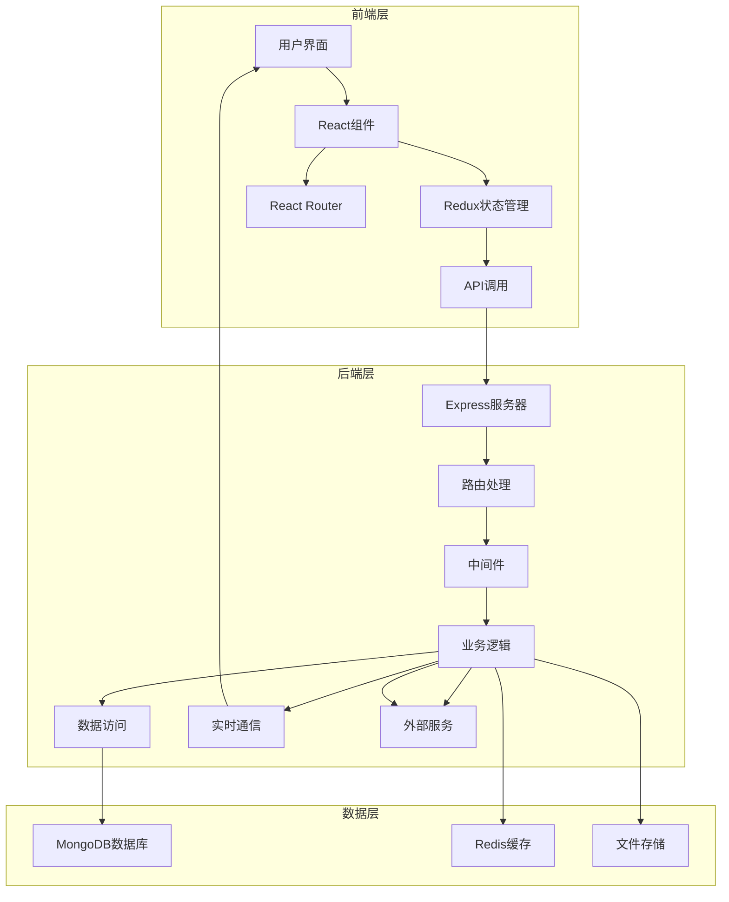

# 劳动仲裁调解系统 - React.js + Node.js技术方案

## 1. 项目概述

本技术方案基于React.js和Node.js技术栈，旨在为劳动仲裁调解中心提供一个现代化、高效、可扩展的数字化解决方案。系统支持多角色登录、案件管理、到访登记、调解申请等核心功能，实现从案件登记到结案的全流程管理。

## 2. 技术架构

### 2.1 技术栈选择

| 分类 | 技术 | 版本 | 选型理由 |
| :--- | :--- | :--- | :--- |
| 前端 | React.js | 18.x | 组件化开发，虚拟DOM，性能优异 |
| 前端 | TypeScript | 5.x | 类型安全，提高代码质量和可维护性 |
| 前端 | Ant Design | 5.x | 企业级UI组件库，丰富的表单和数据展示组件 |
| 前端 | Redux Toolkit | 2.x | 状态管理，简化Redux使用 |
| 前端 | React Router | 6.x | 路由管理，支持嵌套路由和导航守卫 |
| 前端 | Axios | 1.x | HTTP客户端，处理API请求 |
| 前端 | ECharts | 5.x | 数据可视化，图表展示 |
| 后端 | Node.js | 18.x | 高性能JavaScript运行时，适合构建API服务 |
| 后端 | Express | 4.x | 轻量级Web框架，易于使用和扩展 |
| 后端 | MongoDB | 6.x | 文档型数据库，适合存储结构化和半结构化数据 |
| 后端 | Redis | 7.x | 缓存系统，用于存储会话和热点数据 |
| 后端 | JWT | - | 无状态认证，适合RESTful API |
| 后端 | Mongoose | 7.x | MongoDB对象模型工具，简化数据库操作 |
| 后端 | Socket.io | 4.x | 实时通信，用于站内广播和通知 |
| 部署 | Docker | 20.x | 容器化部署，提供一致的运行环境 |
| 部署 | Nginx | 1.20+ | 反向代理，处理静态资源和负载均衡 |

### 2.2 系统架构



### 2.3 核心模块

#### 2.3.1 前端模块

| 模块 | 功能描述 | 技术实现 | 文件位置 |
| :--- | :--- | :--- | :--- |
| 登录认证 | 多角色登录、权限验证 | React + Redux + JWT | `src/pages/Login.tsx` |
| 工作台 | 个性化数据展示、待办事项 | React + Ant Design + ECharts | `src/pages/Dashboard.tsx` |
| 到访登记 | 记录来访信息、生成编号 | React + Ant Design | `src/pages/VisitorRegister.tsx` |
| 案件查询 | 案件信息检索、结果展示 | React + Ant Design | `src/pages/CaseQuery.tsx` |
| 申请调解 | 多步骤表单、数据验证 | React + Ant Design + Form | `src/pages/CaseApply.tsx` |
| 案件管理 | 案件详情、时间轴、证据管理 | React + Ant Design | `src/pages/CaseManagement.tsx` |
| 站内广播 | 消息发布、通知管理 | React + Socket.io | `src/pages/Broadcast.tsx` |
| 数据分析 | 统计图表、数据可视化 | React + ECharts | `src/pages/DataAnalysis.tsx` |

#### 2.3.2 后端模块

| 模块 | 功能描述 | 技术实现 | 文件位置 |
| :--- | :--- | :--- | :--- |
| 认证服务 | 用户登录、JWT生成与验证 | Express + JWT | `src/routes/auth.js` |
| 案件服务 | 案件CRUD、状态管理 | Express + MongoDB | `src/routes/case.js` |
| 到访服务 | 到访记录管理、编号生成 | Express + MongoDB | `src/routes/visitor.js` |
| 申请服务 | 调解申请流程、数据验证 | Express + MongoDB | `src/routes/application.js` |
| 广播服务 | 消息发布、通知推送 | Express + Socket.io | `src/routes/broadcast.js` |
| 分析服务 | 数据统计、报表生成 | Express + MongoDB | `src/routes/analysis.js` |
| 通知服务 | 短信发送、邮件通知 | Express + 第三方API | `src/services/notification.js` |
| 证据服务 | 证据上传、管理 | Express + GridFS | `src/routes/evidence.js` |

## 3. 数据库设计

### 3.1 数据模型

#### 3.1.1 用户模型

```javascript
// src/models/User.js
const mongoose = require('mongoose');
const Schema = mongoose.Schema;

const UserSchema = new Schema({
  username: {
    type: String,
    required: true,
    unique: true
  },
  password: {
    type: String,
    required: true
  },
  name: {
    type: String,
    required: true
  },
  phone: {
    type: String,
    required: true
  },
  email: {
    type: String
  },
  address: {
    type: String
  },
  role: {
    type: String,
    required: true,
    enum: ['mediator', 'admin', 'personal', 'company']
  },
  idCard: {
    type: String
  },
  createdAt: {
    type: Date,
    default: Date.now
  },
  updatedAt: {
    type: Date,
    default: Date.now
  }
});

module.exports = mongoose.model('User', UserSchema);
```

#### 3.1.2 案件模型

```javascript
// src/models/Case.js
const mongoose = require('mongoose');
const Schema = mongoose.Schema;

const CaseSchema = new Schema({
  caseNumber: {
    type: String,
    required: true,
    unique: true
  },
  applicantId: {
    type: Schema.Types.ObjectId,
    ref: 'User',
    required: true
  },
  respondentId: {
    type: Schema.Types.ObjectId,
    ref: 'User',
    required: true
  },
  disputeType: {
    type: String,
    required: true
  },
  caseAmount: {
    type: Number
  },
  requestItems: {
    type: String,
    required: true
  },
  factsReasons: {
    type: String,
    required: true
  },
  status: {
    type: String,
    required: true,
    enum: ['pending', 'processing', 'completed', 'failed']
  },
  mediatorId: {
    type: Schema.Types.ObjectId,
    ref: 'User'
  },
  createdAt: {
    type: Date,
    default: Date.now
  },
  updatedAt: {
    type: Date,
    default: Date.now
  },
  closeTime: {
    type: Date
  }
});

module.exports = mongoose.model('Case', CaseSchema);
```

#### 3.1.3 到访记录模型

```javascript
// src/models/VisitorRecord.js
const mongoose = require('mongoose');
const Schema = mongoose.Schema;

const VisitorRecordSchema = new Schema({
  registerNumber: {
    type: String,
    required: true,
    unique: true
  },
  visitorName: {
    type: String,
    required: true
  },
  phone: {
    type: String,
    required: true
  },
  visitType: {
    type: String,
    required: true,
    enum: ['visit', 'phone']
  },
  disputeType: {
    type: String
  },
  reason: {
    type: String,
    required: true
  },
  mediatorId: {
    type: Schema.Types.ObjectId,
    ref: 'User'
  },
  createdAt: {
    type: Date,
    default: Date.now
  }
});

module.exports = mongoose.model('VisitorRecord', VisitorRecordSchema);
```

#### 3.1.4 广播模型

```javascript
// src/models/Broadcast.js
const mongoose = require('mongoose');
const Schema = mongoose.Schema;

const BroadcastSchema = new Schema({
  title: {
    type: String,
    required: true
  },
  content: {
    type: String,
    required: true
  },
  type: {
    type: String,
    required: true,
    enum: ['handover', 'special', 'notice', 'policy']
  },
  urgency: {
    type: String,
    required: true,
    enum: ['normal', 'important', 'emergency']
  },
  creatorId: {
    type: Schema.Types.ObjectId,
    ref: 'User',
    required: true
  },
  createdAt: {
    type: Date,
    default: Date.now
  }
});

module.exports = mongoose.model('Broadcast', BroadcastSchema);
```

#### 3.1.5 案件进度模型

```javascript
// src/models/CaseProgress.js
const mongoose = require('mongoose');
const Schema = mongoose.Schema;

const CaseProgressSchema = new Schema({
  caseId: {
    type: Schema.Types.ObjectId,
    ref: 'Case',
    required: true
  },
  content: {
    type: String,
    required: true
  },
  type: {
    type: String,
    required: true,
    enum: ['register', 'accept', 'mediate', 'close']
  },
  creatorId: {
    type: Schema.Types.ObjectId,
    ref: 'User',
    required: true
  },
  createdAt: {
    type: Date,
    default: Date.now
  }
});

module.exports = mongoose.model('CaseProgress', CaseProgressSchema);
```

#### 3.1.6 证据模型

```javascript
// src/models/Evidence.js
const mongoose = require('mongoose');
const Schema = mongoose.Schema;

const EvidenceSchema = new Schema({
  caseId: {
    type: Schema.Types.ObjectId,
    ref: 'Case',
    required: true
  },
  name: {
    type: String,
    required: true
  },
  type: {
    type: String,
    required: true,
    enum: ['pdf', 'image', 'word', 'other']
  },
  path: {
    type: String,
    required: true
  },
  uploaderId: {
    type: Schema.Types.ObjectId,
    ref: 'User',
    required: true
  },
  uploadTime: {
    type: Date,
    default: Date.now
  }
});

module.exports = mongoose.model('Evidence', EvidenceSchema);
```

## 4. 技术实现

### 4.1 前端实现

#### 4.1.1 项目初始化

```bash
# 创建React + TypeScript项目
npx create-vite@latest frontend -- --template react-ts

# 安装依赖
cd frontend
npm install antd @ant-design/icons redux react-redux @reduxjs/toolkit react-router-dom axios echarts

# 配置Vite
# vite.config.ts
```

#### 4.1.2 路由配置

```typescript
// src/routes/index.tsx
import { createBrowserRouter } from 'react-router-dom';
import { RootLayout } from '../layouts/RootLayout';
import { Login } from '../pages/Login';
import { Dashboard } from '../pages/Dashboard';
import { VisitorRegister } from '../pages/VisitorRegister';
import { CaseQuery } from '../pages/CaseQuery';
import { CaseApply } from '../pages/CaseApply';
import { CaseManagement } from '../pages/CaseManagement';
import { Broadcast } from '../pages/Broadcast';
import { DataAnalysis } from '../pages/DataAnalysis';
import { RequireAuth } from '../components/RequireAuth';
import { RoleBasedRoute } from '../components/RoleBasedRoute';

const router = createBrowserRouter([
  {
    path: '/',
    element: <RootLayout />,
    children: [
      {
        path: 'login',
        element: <Login />
      },
      {
        path: 'dashboard',
        element: (
          <RequireAuth>
            <Dashboard />
          </RequireAuth>
        )
      },
      {
        path: 'visitor',
        element: (
          <RequireAuth>
            <RoleBasedRoute roles={['mediator']}>
              <VisitorRegister />
            </RoleBasedRoute>
          </RequireAuth>
        )
      },
      {
        path: 'case/query',
        element: (
          <RequireAuth>
            <CaseQuery />
          </RequireAuth>
        )
      },
      {
        path: 'case/apply',
        element: (
          <RequireAuth>
            <RoleBasedRoute roles={['personal', 'company']}>
              <CaseApply />
            </RoleBasedRoute>
          </RequireAuth>
        )
      },
      {
        path: 'case/:id',
        element: (
          <RequireAuth>
            <CaseManagement />
          </RequireAuth>
        )
      },
      {
        path: 'broadcast',
        element: (
          <RequireAuth>
            <RoleBasedRoute roles={['mediator', 'admin']}>
              <Broadcast />
            </RoleBasedRoute>
          </RequireAuth>
        )
      },
      {
        path: 'analysis',
        element: (
          <RequireAuth>
            <RoleBasedRoute roles={['mediator', 'admin']}>
              <DataAnalysis />
            </RoleBasedRoute>
          </RequireAuth>
        )
      }
    ]
  }
]);

export default router;
```

#### 4.1.3 状态管理

```typescript
// src/store/authSlice.ts
import { createSlice, createAsyncThunk, PayloadAction } from '@reduxjs/toolkit';
import axios from 'axios';

interface AuthState {
  token: string | null;
  userInfo: any | null;
  isAuthenticated: boolean;
  loading: boolean;
  error: string | null;
}

const initialState: AuthState = {
  token: localStorage.getItem('token'),
  userInfo: localStorage.getItem('userInfo') ? JSON.parse(localStorage.getItem('userInfo') || 'null') : null,
  isAuthenticated: !!localStorage.getItem('token'),
  loading: false,
  error: null
};

export const login = createAsyncThunk(
  'auth/login',
  async (credentials: { username: string; password: string; role: string }, { rejectWithValue }) => {
    try {
      const response = await axios.post('/api/auth/login', credentials);
      return response.data;
    } catch (error: any) {
      return rejectWithValue(error.response?.data?.message || 'Login failed');
    }
  }
);

const authSlice = createSlice({
  name: 'auth',
  initialState,
  reducers: {
    logout: (state) => {
      state.token = null;
      state.userInfo = null;
      state.isAuthenticated = false;
      localStorage.removeItem('token');
      localStorage.removeItem('userInfo');
    },
    clearError: (state) => {
      state.error = null;
    }
  },
  extraReducers: (builder) => {
    builder
      .addCase(login.pending, (state) => {
        state.loading = true;
        state.error = null;
      })
      .addCase(login.fulfilled, (state, action) => {
        state.loading = false;
        state.token = action.payload.token;
        state.userInfo = action.payload.userInfo;
        state.isAuthenticated = true;
        localStorage.setItem('token', action.payload.token);
        localStorage.setItem('userInfo', JSON.stringify(action.payload.userInfo));
      })
      .addCase(login.rejected, (state, action) => {
        state.loading = false;
        state.error = action.payload as string;
      });
  }
});

export const { logout, clearError } = authSlice.actions;
export default authSlice.reducer;
```

#### 4.1.4 API调用

```typescript
// src/services/api.ts
import axios from 'axios';

const api = axios.create({
  baseURL: '/api',
  timeout: 10000,
  headers: {
    'Content-Type': 'application/json'
  }
});

api.interceptors.request.use(
  (config) => {
    const token = localStorage.getItem('token');
    if (token) {
      config.headers.Authorization = `Bearer ${token}`;
    }
    return config;
  },
  (error) => {
    return Promise.reject(error);
  }
);

api.interceptors.response.use(
  (response) => {
    return response;
  },
  (error) => {
    if (error.response && error.response.status === 401) {
      localStorage.removeItem('token');
      localStorage.removeItem('userInfo');
      window.location.href = '/login';
    }
    return Promise.reject(error);
  }
);

export default api;
```

### 4.2 后端实现

#### 4.2.1 项目初始化

```bash
# 创建Node.js项目
mkdir backend
cd backend
npm init -y

# 安装依赖
npm install express mongoose jsonwebtoken bcryptjs cors dotenv multer socket.io redis express-validator

# 安装开发依赖
npm install --save-dev typescript ts-node @types/express @types/mongoose @types/jsonwebtoken @types/bcryptjs @types/cors @types/multer @types/node

# 配置TypeScript
npx tsc --init
```

#### 4.2.2 服务器配置

```javascript
// src/server.js
const express = require('express');
const cors = require('cors');
const dotenv = require('dotenv');
const mongoose = require('mongoose');
const authRoutes = require('./routes/auth');
const caseRoutes = require('./routes/case');
const visitorRoutes = require('./routes/visitor');
const applicationRoutes = require('./routes/application');
const broadcastRoutes = require('./routes/broadcast');
const analysisRoutes = require('./routes/analysis');
const evidenceRoutes = require('./routes/evidence');
const { setupSocketIO } = require('./services/socket');

// 配置环境变量
dotenv.config();

const app = express();
const PORT = process.env.PORT || 5000;

// 中间件
app.use(cors());
app.use(express.json());
app.use(express.urlencoded({ extended: true }));

// 数据库连接
mongoose.connect(process.env.MONGO_URI, {
  useNewUrlParser: true,
  useUnifiedTopology: true
}).then(() => {
  console.log('MongoDB connected');
}).catch(err => {
  console.error('MongoDB connection error:', err);
});

// 路由
app.use('/api/auth', authRoutes);
app.use('/api/case', caseRoutes);
app.use('/api/visitor', visitorRoutes);
app.use('/api/application', applicationRoutes);
app.use('/api/broadcast', broadcastRoutes);
app.use('/api/analysis', analysisRoutes);
app.use('/api/evidence', evidenceRoutes);

// 健康检查
app.get('/api/health', (req, res) => {
  res.json({ status: 'ok' });
});

// 静态文件
app.use(express.static('public'));

// 启动服务器
const server = app.listen(PORT, () => {
  console.log(`Server running on port ${PORT}`);
});

// 设置Socket.io
setupSocketIO(server);
```

#### 4.2.3 认证授权

```javascript
// src/middleware/auth.js
const jwt = require('jsonwebtoken');

const auth = (req, res, next) => {
  const token = req.header('Authorization')?.replace('Bearer ', '');
  
  if (!token) {
    return res.status(401).json({ message: 'No token, authorization denied' });
  }
  
  try {
    const decoded = jwt.verify(token, process.env.JWT_SECRET);
    req.user = decoded;
    next();
  } catch (error) {
    res.status(401).json({ message: 'Token is not valid' });
  }
};

const roleAuth = (roles) => {
  return (req, res, next) => {
    if (!roles.includes(req.user.role)) {
      return res.status(403).json({ message: 'Access denied' });
    }
    next();
  };
};

module.exports = { auth, roleAuth };
```

#### 4.2.4 案件管理

```javascript
// src/routes/case.js
const express = require('express');
const router = express.Router();
const { auth, roleAuth } = require('../middleware/auth');
const Case = require('../models/Case');
const CaseProgress = require('../models/CaseProgress');
const Evidence = require('../models/Evidence');

// 获取案件列表
router.get('/', auth, async (req, res) => {
  try {
    const { status } = req.query;
    const query = status ? { status } : {};
    
    // 根据用户角色过滤案件
    if (req.user.role === 'personal' || req.user.role === 'company') {
      query.$or = [
        { applicantId: req.user.id },
        { respondentId: req.user.id }
      ];
    } else if (req.user.role === 'mediator') {
      query.mediatorId = req.user.id;
    }
    
    const cases = await Case.find(query).populate(['applicantId', 'respondentId', 'mediatorId']);
    res.json(cases);
  } catch (error) {
    res.status(500).json({ message: 'Server error' });
  }
});

// 获取案件详情
router.get('/:id', auth, async (req, res) => {
  try {
    const caseId = req.params.id;
    const caseData = await Case.findById(caseId).populate(['applicantId', 'respondentId', 'mediatorId']);
    
    if (!caseData) {
      return res.status(404).json({ message: 'Case not found' });
    }
    
    // 检查权限
    const isAuthorized = 
      req.user.role === 'admin' ||
      req.user.role === 'mediator' ||
      caseData.applicantId.equals(req.user.id) ||
      caseData.respondentId.equals(req.user.id);
    
    if (!isAuthorized) {
      return res.status(403).json({ message: 'Access denied' });
    }
    
    const progress = await CaseProgress.find({ caseId }).populate('creatorId');
    const evidence = await Evidence.find({ caseId }).populate('uploaderId');
    
    res.json({ case: caseData, progress, evidence });
  } catch (error) {
    res.status(500).json({ message: 'Server error' });
  }
});

// 创建案件
router.post('/', auth, async (req, res) => {
  try {
    const { applicantId, respondentId, disputeType, caseAmount, requestItems, factsReasons } = req.body;
    
    // 生成案件编号
    const caseNumber = `LA${new Date().getFullYear()}${String(new Date().getMonth() + 1).padStart(2, '0')}${String(new Date().getDate()).padStart(2, '0')}${String(Math.floor(Math.random() * 1000)).padStart(3, '0')}`;
    
    const newCase = new Case({
      caseNumber,
      applicantId,
      respondentId,
      disputeType,
      caseAmount,
      requestItems,
      factsReasons,
      status: 'pending'
    });
    
    await newCase.save();
    
    // 创建案件进度记录
    const progress = new CaseProgress({
      caseId: newCase._id,
      content: '案件已登记',
      type: 'register',
      creatorId: req.user.id
    });
    
    await progress.save();
    
    res.status(201).json({ case: newCase, caseNumber });
  } catch (error) {
    res.status(500).json({ message: 'Server error' });
  }
});

// 更新案件状态
router.put('/:id/status', auth, async (req, res) => {
  try {
    const caseId = req.params.id;
    const { status } = req.body;
    
    const caseData = await Case.findById(caseId);
    if (!caseData) {
      return res.status(404).json({ message: 'Case not found' });
    }
    
    // 检查权限
    if (req.user.role !== 'admin' && req.user.role !== 'mediator') {
      return res.status(403).json({ message: 'Access denied' });
    }
    
    caseData.status = status;
    if (status === 'completed' || status === 'failed') {
      caseData.closeTime = new Date();
    }
    
    await caseData.save();
    
    // 创建案件进度记录
    const progress = new CaseProgress({
      caseId: caseData._id,
      content: `案件状态更新为${status}`,
      type: status === 'completed' ? 'close' : 'mediate',
      creatorId: req.user.id
    });
    
    await progress.save();
    
    res.json({ case: caseData, success: true });
  } catch (error) {
    res.status(500).json({ message: 'Server error' });
  }
});

module.exports = router;
```

#### 4.2.5 实时通信

```javascript
// src/services/socket.js
const socketIO = require('socket.io');

let io;

const setupSocketIO = (server) => {
  io = socketIO(server, {
    cors: {
      origin: '*',
      methods: ['GET', 'POST']
    }
  });
  
  io.on('connection', (socket) => {
    console.log('New socket connection:', socket.id);
    
    // 加入房间
    socket.on('joinRoom', (room) => {
      socket.join(room);
      console.log(`Socket ${socket.id} joined room ${room}`);
    });
    
    // 发送广播消息
    socket.on('broadcastMessage', (message) => {
      io.emit('newBroadcast', message);
    });
    
    // 发送案件更新
    socket.on('caseUpdate', (caseId) => {
      io.emit('caseUpdated', caseId);
    });
    
    // 断开连接
    socket.on('disconnect', () => {
      console.log('Socket disconnected:', socket.id);
    });
  });
};

const getIO = () => {
  if (!io) {
    throw new Error('Socket.IO not initialized');
  }
  return io;
};

module.exports = { setupSocketIO, getIO };
```

## 5. 部署方案

### 5.1 Docker Compose配置

```yaml
# docker-compose.yml
version: '3.8'

services:
  nginx:
    image: nginx:1.20-alpine
    ports:
      - "80:80"
    volumes:
      - ./nginx/nginx.conf:/etc/nginx/nginx.conf:ro
      - ./frontend/build:/usr/share/nginx/html:ro
    depends_on:
      - backend
    restart: always
  
  backend:
    build:
      context: ./backend
      dockerfile: Dockerfile
    ports:
      - "5000:5000"
    environment:
      - MONGO_URI=mongodb://mongo:27017/laodong
      - JWT_SECRET=your_jwt_secret
      - REDIS_URL=redis://redis:6379
    depends_on:
      - mongo
      - redis
    restart: always
  
  mongo:
    image: mongo:6.0
    ports:
      - "27017:27017"
    volumes:
      - mongo-data:/data/db
    restart: always
  
  redis:
    image: redis:7.0-alpine
    ports:
      - "6379:6379"
    volumes:
      - redis-data:/data
    restart: always

volumes:
  mongo-data:
  redis-data:
```

### 5.2 Nginx配置

```nginx
# nginx/nginx.conf
user nginx;
worker_processes auto;

events {
    worker_connections 1024;
}

http {
    include /etc/nginx/mime.types;
    default_type application/octet-stream;
    
    sendfile on;
    keepalive_timeout 65;
    
    server {
        listen 80;
        server_name localhost;
        
        root /usr/share/nginx/html;
        index index.html;
        
        location / {
            try_files $uri $uri/ /index.html;
        }
        
        location /api {
            proxy_pass http://backend:5000;
            proxy_set_header Host $host;
            proxy_set_header X-Real-IP $remote_addr;
            proxy_set_header X-Forwarded-For $proxy_add_x_forwarded_for;
            proxy_set_header X-Forwarded-Proto $scheme;
        }
        
        location /socket.io {
            proxy_pass http://backend:5000;
            proxy_http_version 1.1;
            proxy_set_header Upgrade $http_upgrade;
            proxy_set_header Connection "upgrade";
        }
    }
}
```

## 6. 研发计划

### 6.1 项目阶段

| 阶段 | 时间 | 主要任务 | 交付物 |
| :--- | :--- | :--- | :--- |
| 需求分析 | 2周 | 需求收集、分析和整理 | 需求规格说明书 |
| 设计阶段 | 2周 | 架构设计、数据库设计、接口设计 | 设计文档 |
| 前端开发 | 4周 | React组件开发、状态管理、API集成 | 前端代码 |
| 后端开发 | 4周 | Express服务、MongoDB集成、业务逻辑 | 后端代码 |
| 集成测试 | 2周 | 前后端集成、功能测试、性能测试 | 测试报告 |
| 部署上线 | 1周 | 系统部署、数据迁移、用户培训 | 部署文档 |
| 运维监控 | 持续 | 系统监控、bug修复、功能优化 | 运维报告 |

### 6.2 详细任务

#### 6.2.1 前端开发任务

| 任务 | 负责人 | 时间 | 交付物 |
| :--- | :--- | :--- | :--- |
| 项目初始化 | 前端开发 | 1天 | 前端项目结构 |
| 登录模块 | 前端开发 | 2天 | 登录页面 |
| 工作台模块 | 前端开发 | 3天 | 工作台页面 |
| 到访登记模块 | 前端开发 | 2天 | 到访登记页面 |
| 案件查询模块 | 前端开发 | 2天 | 案件查询页面 |
| 申请调解模块 | 前端开发 | 4天 | 申请调解页面 |
| 案件管理模块 | 前端开发 | 4天 | 案件管理页面 |
| 站内广播模块 | 前端开发 | 2天 | 站内广播页面 |
| 数据分析模块 | 前端开发 | 2天 | 数据分析页面 |
| 状态管理 | 前端开发 | 2天 | Redux配置 |
| API集成 | 前端开发 | 2天 | API调用服务 |
| 前端测试 | 前端开发 | 2天 | 前端测试报告 |

#### 6.2.2 后端开发任务

| 任务 | 负责人 | 时间 | 交付物 |
| :--- | :--- | :--- | :--- |
| 项目初始化 | 后端开发 | 1天 | 后端项目结构 |
| 数据库配置 | 后端开发 | 1天 | MongoDB连接配置 |
| 认证授权模块 | 后端开发 | 3天 | 登录认证API |
| 案件管理模块 | 后端开发 | 4天 | 案件管理API |
| 到访登记模块 | 后端开发 | 2天 | 到访登记API |
| 调解申请模块 | 后端开发 | 3天 | 调解申请API |
| 站内广播模块 | 后端开发 | 2天 | 站内广播API |
| 数据分析模块 | 后端开发 | 2天 | 数据分析API |
| 证据管理模块 | 后端开发 | 2天 | 证据上传API |
| 实时通信模块 | 后端开发 | 2天 | Socket.io配置 |
| 后端测试 | 后端开发 | 2天 | 后端测试报告 |

## 7. 技术优势与挑战

### 7.1 技术优势

1. **全栈JavaScript开发**
   - 前后端使用同一种编程语言，团队协作更高效
   - 代码复用性高，减少开发成本
   - 生态系统丰富，有大量成熟的库和工具

2. **快速开发迭代**
   - React的组件化开发提高代码可维护性
   - Express的简洁API设计加速后端开发
   - MongoDB的灵活数据模型适应业务变化

3. **高性能系统**
   - React的虚拟DOM减少DOM操作，提高前端性能
   - Node.js的事件驱动架构处理高并发请求
   - Redis缓存减轻数据库压力

4. **实时通信能力**
   - Socket.io提供实时双向通信
   - 支持站内广播、案件状态实时更新
   - 提升用户体验和工作效率

5. **易于部署和扩展**
   - Docker容器化部署，环境一致性好
   - 水平扩展能力强，支持集群部署
   - 微服务架构便于功能扩展

### 7.2 技术挑战

1. **TypeScript类型定义**
   - 需要为第三方库编写类型定义
   - 类型系统的学习曲线较陡

2. **MongoDB查询优化**
   - 复杂查询的性能优化
   - 索引设计和管理

3. **实时通信性能**
   - 大量并发连接的处理
   - 消息队列的设计和实现

4. **文件上传和存储**
   - 大文件上传的处理
   - 文件存储的安全性和可靠性

5. **系统安全性**
   - JWT令牌的安全管理
   - 防止SQL注入和XSS攻击
   - 敏感数据的加密存储

## 8. 结论与建议

### 8.1 技术方案可行性

基于React.js和Node.js的技术方案完全可行，适合开发劳动仲裁调解系统。该方案具有以下优势：

1. **技术成熟度高**：React和Node.js都是经过大规模生产验证的成熟技术
2. **开发效率高**：全栈JavaScript开发，代码复用性好
3. **性能优异**：React的虚拟DOM和Node.js的事件驱动架构
4. **实时通信**：Socket.io提供实时双向通信能力
5. **易于部署**：Docker容器化部署，环境一致性好

### 8.2 实施建议

1. **团队组建**
   - 招募熟悉React和Node.js的全栈开发工程师
   - 配备专业的UI/UX设计师
   - 安排专人负责测试和运维

2. **开发规范**
   - 制定统一的代码规范和命名约定
   - 使用ESLint和Prettier保证代码质量
   - 建立完善的代码审查机制

3. **项目管理**
   - 使用Jira或Trello管理项目任务
   - 采用敏捷开发方法，定期迭代
   - 建立每日站会和周会制度

4. **测试策略**
   - 编写单元测试和集成测试
   - 使用Jest和React Testing Library进行前端测试
   - 使用Mocha和Chai进行后端测试

5. **运维保障**
   - 建立完善的监控和告警机制
   - 制定应急预案和灾备方案
   - 定期进行系统备份和安全审计

### 8.3 未来展望

1. **功能扩展**
   - 集成视频会议系统，支持在线调解
   - 开发移动应用，提供随时随地的访问能力
   - 增加AI智能分析，辅助调解员决策

2. **技术演进**
   - 采用Next.js框架，提高前端性能和SEO
   - 使用GraphQL替代RESTful API，减少网络传输
   - 引入Serverless架构，降低运维成本

3. **生态系统**
   - 与法院系统对接，实现数据共享
   - 集成电子签名系统，实现无纸化办公
   - 建立开放API平台，支持第三方集成

通过本技术方案的实施，劳动仲裁调解系统将成为一个现代化、高效、可扩展的数字化平台，为劳动仲裁调解中心提供全方位的技术支持，提升工作效率和服务质量。

---

**文档作者**：技术团队
**文档日期**：2026-02-08
**版本**：1.0
