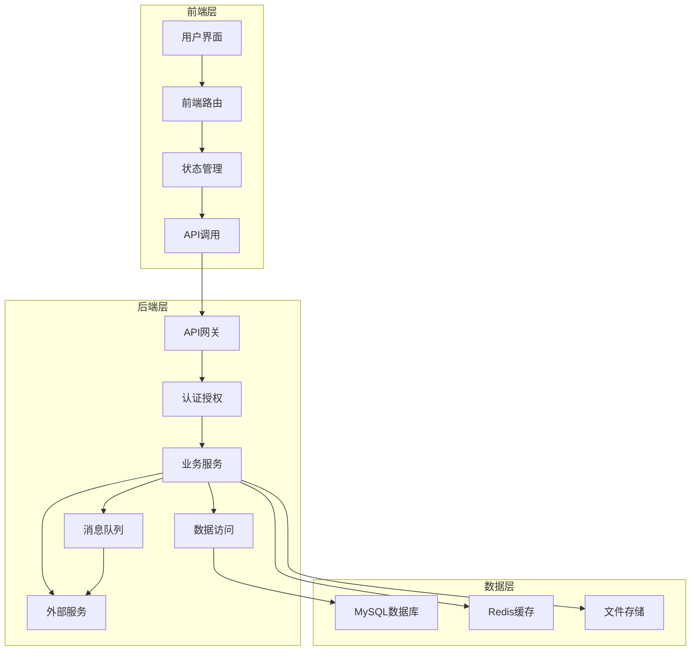
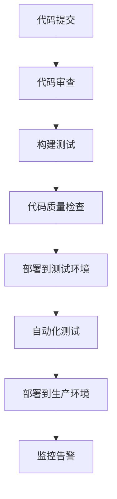

# 劳动仲裁调解系统架构设计

## 1. 架构概述

本架构设计基于前后端分离的微服务架构，旨在为劳动仲裁调解中心提供一个高效、安全、可扩展的数字化解决方案。系统采用分层设计，将前端展示、业务逻辑、数据存储和外部服务解耦，确保系统的灵活性和可维护性。

## 2. 技术架构

### 2.1 系统分层



### 2.2 核心模块

#### 2.2.1 前端模块

| 模块 | 功能描述 | 技术实现 | 文件位置 |
| :--- | :--- | :--- | :--- |
| 登录认证 | 多角色登录、权限验证 | Vue Router、Pinia | `frontend/src/views/Login.vue` |
| 工作台 | 个性化数据展示、待办事项 | Element Plus、ECharts | `frontend/src/views/Dashboard.vue` |
| 到访登记 | 记录来访信息、生成编号 | Vue 3 Composition API | `frontend/src/views/VisitorRegister.vue` |
| 案件查询 | 案件信息检索、结果展示 | Axios、Element Plus | `frontend/src/views/CaseQuery.vue` |
| 申请调解 | 多步骤表单、数据验证 | Vue 3、Element Plus | `frontend/src/views/CaseApply.vue` |
| 案件管理 | 案件详情、时间轴、证据管理 | Vue 3、Element Plus | `frontend/src/views/CaseManagement.vue` |
| 站内广播 | 消息发布、通知管理 | WebSocket、Vue 3 | `frontend/src/views/Broadcast.vue` |
| 数据分析 | 统计图表、数据可视化 | ECharts、Vue 3 | `frontend/src/views/DataAnalysis.vue` |

#### 2.2.2 后端模块

| 模块 | 功能描述 | 技术实现 | 文件位置 |
| :--- | :--- | :--- | :--- |
| 认证服务 | 用户登录、JWT生成与验证 | Spring Security、JWT | `backend/src/main/java/com/laodong/security/` |
| 案件服务 | 案件CRUD、状态管理 | Spring Boot、MyBatis-Plus | `backend/src/main/java/com/laodong/case/` |
| 到访服务 | 到访记录管理、编号生成 | Spring Boot、MyBatis-Plus | `backend/src/main/java/com/laodong/visitor/` |
| 申请服务 | 调解申请流程、数据验证 | Spring Boot、MyBatis-Plus | `backend/src/main/java/com/laodong/application/` |
| 广播服务 | 消息发布、通知推送 | Spring Boot、WebSocket | `backend/src/main/java/com/laodong/broadcast/` |
| 分析服务 | 数据统计、报表生成 | Spring Boot、ECharts | `backend/src/main/java/com/laodong/analysis/` |
| 通知服务 | 短信发送、邮件通知 | Spring Boot、RabbitMQ | `backend/src/main/java/com/laodong/notification/` |
| AI服务 | 案件分析、智能推荐 | Spring Boot、AI模型 | `backend/src/main/java/com/laodong/ai/` |

### 2.3 数据流设计

#### 2.3.1 主要数据流程

1. **用户认证流程**
   - 用户输入账号密码
   - 前端发送登录请求
   - 后端验证用户身份
   - 生成JWT令牌返回
   - 前端存储令牌并跳转

2. **案件申请流程**
   - 用户填写申请信息
   - 前端验证并提交
   - 后端保存案件数据
   - 生成案件编号
   - 发送短信通知
   - 返回申请结果

3. **案件管理流程**
   - 调解员查看案件
   - 更新案件状态
   - 上传证据材料
   - 记录案件进度
   - 生成调解笔录
   - 完成案件结案

4. **站内广播流程**
   - 管理员发布广播
   - 后端保存广播内容
   - 通过WebSocket推送给前端
   - 前端显示广播通知

### 2.4 接口设计

#### 2.4.1 前端接口

| 接口名称 | URL | 方法 | 功能描述 | 请求参数 | 成功响应 |
| :--- | :--- | :--- | :--- | :--- | :--- |
| 用户登录 | `/api/auth/login` | POST | 用户登录认证 | `{username, password, role}` | `{token, userInfo}` |
| 获取工作台数据 | `/api/dashboard` | GET | 获取工作台统计数据 | N/A | `{stats, pendingCases, notifications}` |
| 新增到访记录 | `/api/visitor` | POST | 新增到访登记记录 | `{visitorName, phone, visitType, disputeType, reason}` | `{registerNumber, success}` |
| 查询案件 | `/api/case/query` | GET | 根据条件查询案件 | `{name}` | `{cases: [...]}` |
| 提交调解申请 | `/api/application` | POST | 提交调解申请 | `{applicantInfo, respondentInfo, disputeType, caseAmount, requestItems, factsReasons}` | `{caseNumber, success}` |
| 获取案件详情 | `/api/case/{id}` | GET | 获取案件详细信息 | `{id}` | `{caseInfo, progress, evidence}` |
| 更新案件状态 | `/api/case/{id}/status` | PUT | 更新案件状态 | `{id, status}` | `{success, message}` |
| 上传证据 | `/api/evidence` | POST | 上传案件证据 | `{caseId, file}` | `{evidenceId, success}` |
| 发布广播 | `/api/broadcast` | POST | 发布站内广播 | `{title, content, type, urgency}` | `{broadcastId, success}` |
| 获取广播列表 | `/api/broadcast` | GET | 获取广播消息列表 | N/A | `{broadcasts: [...]}` |
| 获取统计数据 | `/api/analysis/stats` | GET | 获取系统统计数据 | `{startDate, endDate}` | `{stats: [...]}` |

#### 2.4.2 后端接口

| 接口名称 | URL | 方法 | 功能描述 | 实现类 |
| :--- | :--- | :--- | :--- | :--- |
| 登录接口 | `/api/auth/login` | POST | 用户登录认证 | `AuthController.login()` |
| 刷新令牌 | `/api/auth/refresh` | POST | 刷新JWT令牌 | `AuthController.refreshToken()` |
| 获取用户信息 | `/api/auth/user` | GET | 获取当前用户信息 | `AuthController.getUserInfo()` |
| 到访记录列表 | `/api/visitor` | GET | 获取到访记录列表 | `VisitorController.list()` |
| 新增到访记录 | `/api/visitor` | POST | 新增到访记录 | `VisitorController.create()` |
| 案件列表 | `/api/case` | GET | 获取案件列表 | `CaseController.list()` |
| 案件详情 | `/api/case/{id}` | GET | 获取案件详情 | `CaseController.getById()` |
| 创建案件 | `/api/case` | POST | 创建新案件 | `CaseController.create()` |
| 更新案件 | `/api/case/{id}` | PUT | 更新案件信息 | `CaseController.update()` |
| 案件进度 | `/api/case/{id}/progress` | GET | 获取案件进度 | `CaseController.getProgress()` |
| 新增进度 | `/api/case/{id}/progress` | POST | 新增案件进度 | `CaseController.addProgress()` |
| 证据列表 | `/api/evidence` | GET | 获取证据列表 | `EvidenceController.list()` |
| 上传证据 | `/api/evidence` | POST | 上传证据材料 | `EvidenceController.upload()` |
| 广播列表 | `/api/broadcast` | GET | 获取广播列表 | `BroadcastController.list()` |
| 发布广播 | `/api/broadcast` | POST | 发布广播消息 | `BroadcastController.create()` |
| 统计数据 | `/api/analysis/stats` | GET | 获取统计数据 | `AnalysisController.getStats()` |
| 调解员分析 | `/api/analysis/mediator` | GET | 获取调解员分析 | `AnalysisController.getMediatorAnalysis()` |

## 3. 数据库设计

### 3.1 数据模型

#### 3.1.1 用户模型

```java
@Entity
@Table(name = "user")
public class User {
    @Id
    @GeneratedValue(strategy = GenerationType.IDENTITY)
    private Long id;
    
    @Column(unique = true, nullable = false)
    private String username;
    
    @Column(nullable = false)
    private String password;
    
    @Column(nullable = false)
    private String name;
    
    @Column(nullable = false)
    private String phone;
    
    private String email;
    
    private String address;
    
    @Column(nullable = false)
    private String role; // mediator, admin, personal, company
    
    private String idCard;
    
    @Column(nullable = false)
    private LocalDateTime createTime;
    
    @Column(nullable = false)
    private LocalDateTime updateTime;
    
    // getters and setters
}
```

#### 3.1.2 案件模型

```java
@Entity
@Table(name = "case")
public class Case {
    @Id
    @GeneratedValue(strategy = GenerationType.IDENTITY)
    private Long id;
    
    @Column(name = "case_number", unique = true, nullable = false)
    private String caseNumber;
    
    @Column(name = "applicant_id", nullable = false)
    private Long applicantId;
    
    @Column(name = "respondent_id", nullable = false)
    private Long respondentId;
    
    @Column(name = "dispute_type", nullable = false)
    private String disputeType;
    
    @Column(name = "case_amount")
    private BigDecimal caseAmount;
    
    @Column(name = "request_items", nullable = false, columnDefinition = "TEXT")
    private String requestItems;
    
    @Column(name = "facts_reasons", nullable = false, columnDefinition = "TEXT")
    private String factsReasons;
    
    @Column(nullable = false)
    private String status; // pending, processing, completed, failed
    
    @Column(name = "mediator_id")
    private Long mediatorId;
    
    @Column(name = "create_time", nullable = false)
    private LocalDateTime createTime;
    
    @Column(name = "update_time", nullable = false)
    private LocalDateTime updateTime;
    
    @Column(name = "close_time")
    private LocalDateTime closeTime;
    
    // getters and setters
}
```

#### 3.1.3 到访记录模型

```java
@Entity
@Table(name = "visitor_record")
public class VisitorRecord {
    @Id
    @GeneratedValue(strategy = GenerationType.IDENTITY)
    private Long id;
    
    @Column(name = "register_number", unique = true, nullable = false)
    private String registerNumber;
    
    @Column(name = "visitor_name", nullable = false)
    private String visitorName;
    
    @Column(nullable = false)
    private String phone;
    
    @Column(name = "visit_type", nullable = false)
    private String visitType; // visit, phone
    
    @Column(name = "dispute_type")
    private String disputeType;
    
    @Column(nullable = false, columnDefinition = "TEXT")
    private String reason;
    
    @Column(name = "mediator_id")
    private Long mediatorId;
    
    @Column(name = "create_time", nullable = false)
    private LocalDateTime createTime;
    
    // getters and setters
}
```

#### 3.1.4 广播模型

```java
@Entity
@Table(name = "broadcast")
public class Broadcast {
    @Id
    @GeneratedValue(strategy = GenerationType.IDENTITY)
    private Long id;
    
    @Column(nullable = false)
    private String title;
    
    @Column(nullable = false, columnDefinition = "TEXT")
    private String content;
    
    @Column(nullable = false)
    private String type; // handover, special, notice, policy
    
    @Column(nullable = false)
    private String urgency; // normal, important, emergency
    
    @Column(name = "creator_id", nullable = false)
    private Long creatorId;
    
    @Column(name = "create_time", nullable = false)
    private LocalDateTime createTime;
    
    // getters and setters
}
```

#### 3.1.5 案件进度模型

```java
@Entity
@Table(name = "case_progress")
public class CaseProgress {
    @Id
    @GeneratedValue(strategy = GenerationType.IDENTITY)
    private Long id;
    
    @Column(name = "case_id", nullable = false)
    private Long caseId;
    
    @Column(nullable = false, columnDefinition = "TEXT")
    private String content;
    
    @Column(nullable = false)
    private String type; // register, accept, mediate, close
    
    @Column(name = "creator_id", nullable = false)
    private Long creatorId;
    
    @Column(name = "create_time", nullable = false)
    private LocalDateTime createTime;
    
    // getters and setters
}
```

#### 3.1.6 证据模型

```java
@Entity
@Table(name = "evidence")
public class Evidence {
    @Id
    @GeneratedValue(strategy = GenerationType.IDENTITY)
    private Long id;
    
    @Column(name = "case_id", nullable = false)
    private Long caseId;
    
    @Column(nullable = false)
    private String name;
    
    @Column(nullable = false)
    private String type; // pdf, image, word, other
    
    @Column(nullable = false)
    private String path;
    
    @Column(name = "uploader_id", nullable = false)
    private Long uploaderId;
    
    @Column(name = "upload_time", nullable = false)
    private LocalDateTime uploadTime;
    
    // getters and setters
}
```

## 4. 技术实现

### 4.1 前端实现

#### 4.1.1 项目初始化

```bash
# 创建Vue 3项目
npm create vite@latest frontend -- --template vue-ts

# 安装依赖
cd frontend
npm install element-plus axios vue-router@4 pinia echarts

# 配置Vite
# vite.config.ts
```

#### 4.1.2 路由配置

```typescript
// src/router/index.ts
import { createRouter, createWebHistory } from 'vue-router';
import type { RouteRecordRaw } from 'vue-router';
import { useAuthStore } from '../store/auth';

const routes: RouteRecordRaw[] = [
  {
    path: '/',
    redirect: '/login'
  },
  {
    path: '/login',
    name: 'Login',
    component: () => import('../views/Login.vue'),
    meta: { requiresAuth: false }
  },
  {
    path: '/dashboard',
    name: 'Dashboard',
    component: () => import('../views/Dashboard.vue'),
    meta: { requiresAuth: true }
  },
  {
    path: '/visitor',
    name: 'VisitorRegister',
    component: () => import('../views/VisitorRegister.vue'),
    meta: { requiresAuth: true, roles: ['mediator'] }
  },
  {
    path: '/case/query',
    name: 'CaseQuery',
    component: () => import('../views/CaseQuery.vue'),
    meta: { requiresAuth: true }
  },
  {
    path: '/case/apply',
    name: 'CaseApply',
    component: () => import('../views/CaseApply.vue'),
    meta: { requiresAuth: true, roles: ['personal', 'company'] }
  },
  {
    path: '/case/:id',
    name: 'CaseDetail',
    component: () => import('../views/CaseDetail.vue'),
    meta: { requiresAuth: true }
  },
  {
    path: '/broadcast',
    name: 'Broadcast',
    component: () => import('../views/Broadcast.vue'),
    meta: { requiresAuth: true, roles: ['mediator', 'admin'] }
  },
  {
    path: '/analysis',
    name: 'DataAnalysis',
    component: () => import('../views/DataAnalysis.vue'),
    meta: { requiresAuth: true, roles: ['mediator', 'admin'] }
  }
];

const router = createRouter({
  history: createWebHistory(),
  routes
});

// 路由守卫
router.beforeEach((to, from, next) => {
  const authStore = useAuthStore();
  const requiresAuth = to.meta.requiresAuth;
  const requiredRoles = to.meta.roles as string[];
  
  if (requiresAuth && !authStore.isAuthenticated) {
    next('/login');
  } else if (requiredRoles && !requiredRoles.includes(authStore.userRole)) {
    next('/dashboard');
  } else {
    next();
  }
});

export default router;
```

#### 4.1.3 状态管理

```typescript
// src/store/auth.ts
import { defineStore } from 'pinia';
import axios from 'axios';

export const useAuthStore = defineStore('auth', {
  state: () => ({
    token: localStorage.getItem('token') || '',
    userInfo: JSON.parse(localStorage.getItem('userInfo') || 'null'),
    isAuthenticated: !!localStorage.getItem('token')
  }),
  
  getters: {
    userRole: (state) => state.userInfo?.role || ''
  },
  
  actions: {
    async login(username: string, password: string, role: string) {
      try {
        const response = await axios.post('/api/auth/login', {
          username,
          password,
          role
        });
        
        const { token, userInfo } = response.data;
        this.token = token;
        this.userInfo = userInfo;
        this.isAuthenticated = true;
        
        localStorage.setItem('token', token);
        localStorage.setItem('userInfo', JSON.stringify(userInfo));
        
        return true;
      } catch (error) {
        console.error('Login failed:', error);
        return false;
      }
    },
    
    logout() {
      this.token = '';
      this.userInfo = null;
      this.isAuthenticated = false;
      
      localStorage.removeItem('token');
      localStorage.removeItem('userInfo');
    }
  }
});

// src/store/case.ts
import { defineStore } from 'pinia';
import axios from 'axios';

export const useCaseStore = defineStore('case', {
  state: () => ({
    cases: [],
    currentCase: null,
    loading: false,
    error: null
  }),
  
  actions: {
    async fetchCases() {
      this.loading = true;
      try {
        const response = await axios.get('/api/case');
        this.cases = response.data.cases;
        this.error = null;
      } catch (error) {
        console.error('Failed to fetch cases:', error);
        this.error = '获取案件列表失败';
      } finally {
        this.loading = false;
      }
    },
    
    async fetchCaseById(id: string) {
      this.loading = true;
      try {
        const response = await axios.get(`/api/case/${id}`);
        this.currentCase = response.data;
        this.error = null;
      } catch (error) {
        console.error(`Failed to fetch case ${id}:`, error);
        this.error = '获取案件详情失败';
      } finally {
        this.loading = false;
      }
    },
    
    async createCase(caseData: any) {
      this.loading = true;
      try {
        const response = await axios.post('/api/case', caseData);
        this.error = null;
        return response.data;
      } catch (error) {
        console.error('Failed to create case:', error);
        this.error = '创建案件失败';
        return null;
      } finally {
        this.loading = false;
      }
    }
  }
});
```

#### 4.1.4 API调用

```typescript
// src/services/api.ts
import axios from 'axios';
import { useAuthStore } from '../store/auth';

// 创建axios实例
const api = axios.create({
  baseURL: '/api',
  timeout: 10000,
  headers: {
    'Content-Type': 'application/json'
  }
});

// 请求拦截器
api.interceptors.request.use(
  (config) => {
    const authStore = useAuthStore();
    if (authStore.token) {
      config.headers.Authorization = `Bearer ${authStore.token}`;
    }
    return config;
  },
  (error) => {
    return Promise.reject(error);
  }
);

// 响应拦截器
api.interceptors.response.use(
  (response) => {
    return response;
  },
  (error) => {
    if (error.response && error.response.status === 401) {
      const authStore = useAuthStore();
      authStore.logout();
      window.location.href = '/login';
    }
    return Promise.reject(error);
  }
);

export default api;
```

### 4.2 后端实现

#### 4.2.1 项目初始化

```bash
# 创建Spring Boot项目
# 使用Spring Initializr或IDE创建

# 依赖配置
# pom.xml
```

#### 4.2.2 认证授权

```java
// src/main/java/com/laodong/security/JwtTokenProvider.java
import io.jsonwebtoken.Claims;
import io.jsonwebtoken.Jwts;
import io.jsonwebtoken.SignatureAlgorithm;
import org.springframework.beans.factory.annotation.Value;
import org.springframework.security.core.Authentication;
import org.springframework.stereotype.Component;

import java.util.Date;

@Component
public class JwtTokenProvider {
    
    @Value("${app.jwt.secret}")
    private String jwtSecret;
    
    @Value("${app.jwt.expiration-ms}")
    private int jwtExpirationMs;
    
    public String generateToken(Authentication authentication) {
        UserPrincipal userPrincipal = (UserPrincipal) authentication.getPrincipal();
        
        Date now = new Date();
        Date expiryDate = new Date(now.getTime() + jwtExpirationMs);
        
        return Jwts.builder()
            .setSubject(Long.toString(userPrincipal.getId()))
            .setIssuedAt(now)
            .setExpiration(expiryDate)
            .signWith(SignatureAlgorithm.HS512, jwtSecret)
            .compact();
    }
    
    public Long getUserIdFromToken(String token) {
        Claims claims = Jwts.parser()
            .setSigningKey(jwtSecret)
            .parseClaimsJws(token)
            .getBody();
        
        return Long.parseLong(claims.getSubject());
    }
    
    public boolean validateToken(String authToken) {
        try {
            Jwts.parser().setSigningKey(jwtSecret).parseClaimsJws(authToken);
            return true;
        } catch (Exception e) {
            // 处理token验证失败的情况
        }
        return false;
    }
}
```

#### 4.2.3 案件管理

```java
// src/main/java/com/laodong/case/CaseController.java
import org.springframework.beans.factory.annotation.Autowired;
import org.springframework.http.HttpStatus;
import org.springframework.http.ResponseEntity;
import org.springframework.security.access.prepost.PreAuthorize;
import org.springframework.web.bind.annotation.*;

import java.util.List;

@RestController
@RequestMapping("/api/case")
public class CaseController {
    
    @Autowired
    private CaseService caseService;
    
    @GetMapping
    public ResponseEntity<List<CaseDto>> list(@RequestParam(required = false) String status) {
        List<CaseDto> cases = caseService.list(status);
        return ResponseEntity.ok(cases);
    }
    
    @GetMapping("/{id}")
    public ResponseEntity<CaseDetailDto> getById(@PathVariable Long id) {
        CaseDetailDto caseDetail = caseService.getById(id);
        return ResponseEntity.ok(caseDetail);
    }
    
    @PostMapping
    public ResponseEntity<CaseCreationDto> create(@RequestBody CaseCreationDto caseDto) {
        CaseCreationDto createdCase = caseService.create(caseDto);
        return ResponseEntity.status(HttpStatus.CREATED).body(createdCase);
    }
    
    @PutMapping("/{id}")
    public ResponseEntity<CaseDto> update(@PathVariable Long id, @RequestBody CaseDto caseDto) {
        CaseDto updatedCase = caseService.update(id, caseDto);
        return ResponseEntity.ok(updatedCase);
    }
    
    @PutMapping("/{id}/status")
    public ResponseEntity<StatusUpdateDto> updateStatus(@PathVariable Long id, @RequestBody StatusUpdateDto statusDto) {
        StatusUpdateDto updatedStatus = caseService.updateStatus(id, statusDto);
        return ResponseEntity.ok(updatedStatus);
    }
    
    @GetMapping("/{id}/progress")
    public ResponseEntity<List<CaseProgressDto>> getProgress(@PathVariable Long id) {
        List<CaseProgressDto> progressList = caseService.getProgress(id);
        return ResponseEntity.ok(progressList);
    }
    
    @PostMapping("/{id}/progress")
    public ResponseEntity<CaseProgressDto> addProgress(@PathVariable Long id, @RequestBody CaseProgressDto progressDto) {
        CaseProgressDto createdProgress = caseService.addProgress(id, progressDto);
        return ResponseEntity.status(HttpStatus.CREATED).body(createdProgress);
    }
}
```

#### 4.2.4 数据访问

```java
// src/main/java/com/laodong/case/CaseMapper.java
import com.baomidou.mybatisplus.core.mapper.BaseMapper;
import com.laodong.case.entity.Case;
import org.apache.ibatis.annotations.Mapper;

@Mapper
public interface CaseMapper extends BaseMapper<Case> {
    // 自定义查询方法
}

// src/main/java/com/laodong/case/CaseService.java
import com.baomidou.mybatisplus.extension.service.IService;
import com.baomidou.mybatisplus.extension.service.impl.ServiceImpl;
import com.laodong.case.entity.Case;
import com.laodong.case.mapper.CaseMapper;
import com.laodong.case.dto.*;
import org.springframework.beans.BeanUtils;
import org.springframework.beans.factory.annotation.Autowired;
import org.springframework.stereotype.Service;

import java.time.LocalDateTime;
import java.util.List;
import java.util.stream.Collectors;

@Service
public class CaseService extends ServiceImpl<CaseMapper, Case> implements IService<Case> {
    
    @Autowired
    private CaseMapper caseMapper;
    
    @Autowired
    private CaseProgressService caseProgressService;
    
    @Autowired
    private EvidenceService evidenceService;
    
    public List<CaseDto> list(String status) {
        // 实现案件列表查询逻辑
    }
    
    public CaseDetailDto getById(Long id) {
        // 实现案件详情查询逻辑
    }
    
    public CaseCreationDto create(CaseCreationDto caseDto) {
        // 实现案件创建逻辑
    }
    
    public CaseDto update(Long id, CaseDto caseDto) {
        // 实现案件更新逻辑
    }
    
    public StatusUpdateDto updateStatus(Long id, StatusUpdateDto statusDto) {
        // 实现案件状态更新逻辑
    }
    
    public List<CaseProgressDto> getProgress(Long id) {
        // 实现案件进度查询逻辑
    }
    
    public CaseProgressDto addProgress(Long id, CaseProgressDto progressDto) {
        // 实现案件进度添加逻辑
    }
}
```

### 4.3 安全配置

#### 4.3.1 Spring Security配置

```java
// src/main/java/com/laodong/security/SecurityConfig.java
import org.springframework.beans.factory.annotation.Autowired;
import org.springframework.context.annotation.Bean;
import org.springframework.context.annotation.Configuration;
import org.springframework.security.authentication.AuthenticationManager;
import org.springframework.security.config.annotation.authentication.configuration.AuthenticationConfiguration;
import org.springframework.security.config.annotation.method.configuration.EnableMethodSecurity;
import org.springframework.security.config.annotation.web.builders.HttpSecurity;
import org.springframework.security.config.annotation.web.configuration.EnableWebSecurity;
import org.springframework.security.config.http.SessionCreationPolicy;
import org.springframework.security.crypto.bcrypt.BCryptPasswordEncoder;
import org.springframework.security.crypto.password.PasswordEncoder;
import org.springframework.security.web.SecurityFilterChain;
import org.springframework.security.web.authentication.UsernamePasswordAuthenticationFilter;

@Configuration
@EnableWebSecurity
@EnableMethodSecurity(prePostEnabled = true)
public class SecurityConfig {
    
    @Autowired
    private JwtTokenProvider tokenProvider;
    
    @Autowired
    private JwtAuthenticationEntryPoint jwtAuthenticationEntryPoint;
    
    @Autowired
    private JwtAccessDeniedHandler jwtAccessDeniedHandler;
    
    @Bean
    public PasswordEncoder passwordEncoder() {
        return new BCryptPasswordEncoder();
    }
    
    @Bean
    public AuthenticationManager authenticationManager(AuthenticationConfiguration authConfig) throws Exception {
        return authConfig.getAuthenticationManager();
    }
    
    @Bean
    public JwtAuthenticationFilter jwtAuthenticationFilter() {
        return new JwtAuthenticationFilter(tokenProvider);
    }
    
    @Bean
    public SecurityFilterChain filterChain(HttpSecurity http) throws Exception {
        http
            .cors().and().csrf().disable()
            .exceptionHandling()
                .authenticationEntryPoint(jwtAuthenticationEntryPoint)
                .accessDeniedHandler(jwtAccessDeniedHandler)
            .and()
            .sessionManagement()
                .sessionCreationPolicy(SessionCreationPolicy.STATELESS)
            .and()
            .authorizeRequests()
                .antMatchers("/api/auth/**").permitAll()
                .antMatchers("/api/public/**").permitAll()
                .anyRequest().authenticated();
        
        http.addFilterBefore(jwtAuthenticationFilter(), UsernamePasswordAuthenticationFilter.class);
        
        return http.build();
    }
}
```

## 5. 部署方案

### 5.1 容器化部署

#### 5.1.1 Docker Compose配置

```yaml
# docker-compose.yml
version: '3.8'

services:
  nginx:
    image: nginx:1.20-alpine
    ports:
      - "80:80"
    volumes:
      - ./nginx/nginx.conf:/etc/nginx/nginx.conf:ro
      - ./frontend/dist:/usr/share/nginx/html:ro
    depends_on:
      - backend
    restart: always
  
  backend:
    build:
      context: ./backend
      dockerfile: Dockerfile
    ports:
      - "8080:8080"
    environment:
      - SPRING_DATASOURCE_URL=jdbc:mysql://mysql:3306/laodong?useSSL=false&serverTimezone=Asia/Shanghai
      - SPRING_DATASOURCE_USERNAME=root
      - SPRING_DATASOURCE_PASSWORD=password
      - SPRING_REDIS_HOST=redis
      - SPRING_REDIS_PORT=6379
      - RABBITMQ_HOST=rabbitmq
      - RABBITMQ_PORT=5672
      - RABBITMQ_USERNAME=guest
      - RABBITMQ_PASSWORD=guest
    depends_on:
      - mysql
      - redis
      - rabbitmq
    restart: always
  
  mysql:
    image: mysql:8.0
    ports:
      - "3306:3306"
    environment:
      - MYSQL_ROOT_PASSWORD=password
      - MYSQL_DATABASE=laodong
    volumes:
      - mysql-data:/var/lib/mysql
    restart: always
  
  redis:
    image: redis:7.0-alpine
    ports:
      - "6379:6379"
    volumes:
      - redis-data:/data
    restart: always
  
  rabbitmq:
    image: rabbitmq:3.10-alpine
    ports:
      - "5672:5672"
      - "15672:15672"
    volumes:
      - rabbitmq-data:/var/lib/rabbitmq
    restart: always

volumes:
  mysql-data:
  redis-data:
  rabbitmq-data:
```

#### 5.1.2 Nginx配置

```nginx
# nginx/nginx.conf
user nginx;
worker_processes auto;

events {
    worker_connections 1024;
}

http {
    include /etc/nginx/mime.types;
    default_type application/octet-stream;
    
    sendfile on;
    keepalive_timeout 65;
    
    server {
        listen 80;
        server_name localhost;
        
        root /usr/share/nginx/html;
        index index.html;
        
        location / {
            try_files $uri $uri/ /index.html;
        }
        
        location /api {
            proxy_pass http://backend:8080;
            proxy_set_header Host $host;
            proxy_set_header X-Real-IP $remote_addr;
            proxy_set_header X-Forwarded-For $proxy_add_x_forwarded_for;
            proxy_set_header X-Forwarded-Proto $scheme;
        }
    }
}
```

### 5.2 持续集成/持续部署

#### 5.2.1 CI/CD流程



#### 5.2.2 Jenkins配置

```groovy
// Jenkinsfile
pipeline {
    agent any
    
    stages {
        stage('Checkout') {
            steps {
                checkout scm
            }
        }
        
        stage('Frontend Build') {
            steps {
                dir('frontend') {
                    sh 'npm install'
                    sh 'npm run build'
                }
            }
        }
        
        stage('Backend Build') {
            steps {
                dir('backend') {
                    sh 'mvn clean package -DskipTests'
                }
            }
        }
        
        stage('Docker Build') {
            steps {
                sh 'docker-compose build'
            }
        }
        
        stage('Deploy') {
            steps {
                sh 'docker-compose up -d'
            }
        }
        
        stage('Test') {
            steps {
                sh 'curl -s http://localhost/api/health'
            }
        }
    }
    
    post {
        success {
            echo 'Deployment successful!'
        }
        failure {
            echo 'Deployment failed!'
        }
    }
}
```

## 6. 监控与运维

### 6.1 系统监控

| 监控项 | 监控工具 | 告警阈值 | 处理方式 |
| :--- | :--- | :--- | :--- |
| 系统负载 | Prometheus + Grafana | CPU > 80%, 内存 > 85% | 自动扩容 |
| 数据库性能 | Prometheus + Grafana | 查询响应时间 > 500ms | 优化查询 |
| API响应时间 | Prometheus + Grafana | 响应时间 > 1s | 性能优化 |
| 错误率 | ELK Stack | 错误率 > 5% | 自动告警 |
| 日志分析 | ELK Stack | N/A | 定期分析 |

### 6.2 日志管理

```yaml
# logback-spring.xml
<configuration>
    <appender name="console" class="ch.qos.logback.core.ConsoleAppender">
        <encoder>
            <pattern>%d{HH:mm:ss.SSS} [%thread] %-5level %logger{36} - %msg%n</pattern>
        </encoder>
    </appender>
    
    <appender name="file" class="ch.qos.logback.core.rolling.RollingFileAppender">
        <file>logs/application.log</file>
        <rollingPolicy class="ch.qos.logback.core.rolling.SizeAndTimeBasedRollingPolicy">
            <fileNamePattern>logs/application-%d{yyyy-MM-dd}.%i.log.gz</fileNamePattern>
            <maxFileSize>10MB</maxFileSize>
            <maxHistory>30</maxHistory>
            <totalSizeCap>1GB</totalSizeCap>
        </rollingPolicy>
        <encoder>
            <pattern>%d{HH:mm:ss.SSS} [%thread] %-5level %logger{36} - %msg%n</pattern>
        </encoder>
    </appender>
    
    <root level="info">
        <appender-ref ref="console" />
        <appender-ref ref="file" />
    </root>
</configuration>
```

### 6.3 备份与恢复

| 备份项 | 备份策略 | 恢复方式 |
| :--- | :--- | :--- |
| 数据库 | 每日全量备份，每小时增量备份 | 从最近备份恢复 |
| 配置文件 | 每次修改后备份 | 从备份文件恢复 |
| 日志文件 | 保留30天 | 从归档恢复 |
| 证据文件 | 每日备份 | 从备份存储恢复 |

## 7. 扩展性设计

### 7.1 水平扩展

- **前端**：使用CDN加速静态资源，支持多节点部署
- **后端**：基于Spring Boot的无状态设计，支持集群部署
- **数据库**：支持主从复制和读写分离
- **缓存**：Redis集群，支持数据分片

### 7.2 功能扩展

- **微服务拆分**：将核心服务拆分为独立的微服务
- **插件系统**：支持功能插件的动态加载
- **API网关**：统一管理API路由和版本控制
- **外部集成**：提供标准API接口，支持与其他系统集成

### 7.3 技术演进

- **容器编排**：使用Kubernetes管理容器集群
- **服务网格**：使用Istio实现服务间通信和流量管理
- **Serverless**：将部分功能迁移到Serverless架构
- **AI增强**：集成更高级的AI模型，提供智能推荐和预测

## 8. 结论

本架构设计提供了一个完整的劳动仲裁调解系统技术方案，涵盖了前端展示、后端逻辑、数据存储和运维监控等各个方面。系统采用现代化的技术栈和架构模式，确保了系统的高性能、高可靠性和可扩展性。通过本架构的实施，劳动仲裁调解中心将实现案件管理的数字化、规范化和智能化，提高工作效率和服务质量。

---

**文档作者**：技术团队
**文档日期**：2026-02-08
**版本**：1.0
