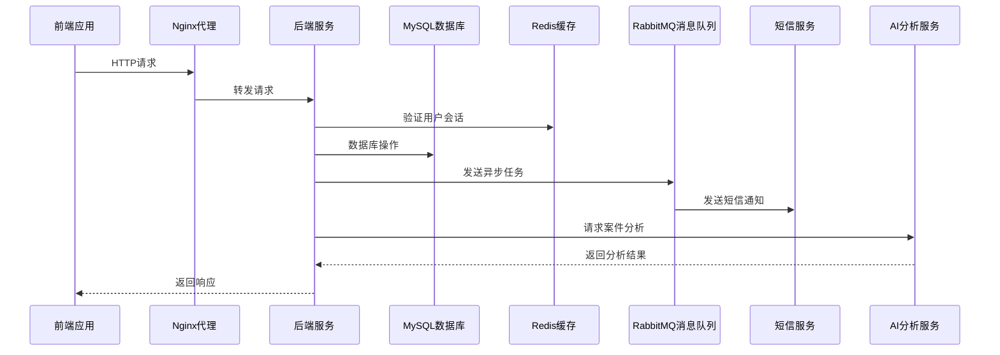

# 劳动仲裁调解系统研发计划

## 1. 项目概述

本项目是一个劳动仲裁调解系统，旨在为街道劳动人事争议调解中心提供完整的案件管理、调解流程跟踪和信息管理功能。系统支持多种用户角色，包括调解员、管理员、个人用户和企业用户，提供从案件登记到结案的全流程管理。

### 1.1 核心功能

- **多角色登录系统**：支持调解员、管理员、个人和企业账号登录
- **工作台**：不同角色的个性化工作台，展示关键信息和待办事项
- **到访登记**：记录每日到访/来电信息，生成登记编号并发送短信链接
- **案件查询**：通过当事人姓名查询案件基本信息
- **申请调解**：多步骤表单，引导用户完成调解申请
- **案件管理**：案件时间轴、证据材料管理、线上调解会议
- **站内广播**：发布值班交接、工作通知等信息
- **数据分析**：调解员工作量和成功率分析

### 1.2 技术现状

现有原型代码是基于HTML、CSS和JavaScript的前端实现，使用了Bootstrap和Font Awesome等前端库。系统界面美观，功能完整，但需要后端服务支持才能实现完整功能。

## 2. 软件架构设计

### 2.1 技术栈选择

| 分类 | 技术 | 版本 | 选型理由 |
| :--- | :--- | :--- | :--- |
| 前端 | Vue.js | 3.x | 响应式框架，适合构建复杂的单页应用 |
| 前端 | TypeScript | 5.x | 提供类型安全，减少运行时错误 |
| 前端 | Element Plus | 2.x | 基于Vue 3的UI组件库，提供丰富的表单和数据展示组件 |
| 前端 | Axios | 1.x | 处理HTTP请求，支持拦截器和请求/响应转换 |
| 前端 | Vue Router | 4.x | 管理应用路由，支持嵌套路由和导航守卫 |
| 前端 | Pinia | 2.x | 状态管理库，替代Vuex，提供更简洁的API |
| 后端 | Spring Boot | 3.x | 快速构建RESTful API，提供自动配置和依赖管理 |
| 后端 | Spring Security | 6.x | 提供认证和授权功能，保护API安全 |
| 后端 | MyBatis-Plus | 3.x | ORM框架，简化数据库操作 |
| 后端 | MySQL | 8.x | 关系型数据库，适合存储结构化的案件数据 |
| 后端 | Redis | 7.x | 缓存系统，用于存储会话和热点数据 |
| 后端 | RabbitMQ | 3.x | 消息队列，用于处理异步任务如短信发送 |
| 部署 | Docker | 20.x | 容器化部署，提供一致的运行环境 |
| 部署 | Nginx | 1.20+ | 反向代理，处理静态资源和负载均衡 |

### 2.2 架构设计

#### 2.2.1 系统架构图



#### 2.2.2 模块划分

| 模块 | 职责 | 文件位置 |
| :--- | :--- | :--- |
| 认证授权模块 | 用户登录、权限管理 | `backend/src/main/java/com/laodong/security/` |
| 案件管理模块 | 案件CRUD、状态管理 | `backend/src/main/java/com/laodong/case/` |
| 到访登记模块 | 到访记录管理 | `backend/src/main/java/com/laodong/visitor/` |
| 调解申请模块 | 调解申请流程管理 | `backend/src/main/java/com/laodong/application/` |
| 站内广播模块 | 广播消息管理 | `backend/src/main/java/com/laodong/broadcast/` |
| 数据分析模块 | 统计分析功能 | `backend/src/main/java/com/laodong/analysis/` |
| 通知服务模块 | 短信、邮件通知 | `backend/src/main/java/com/laodong/notification/` |
| AI分析模块 | 案件智能分析 | `backend/src/main/java/com/laodong/ai/` |

#### 2.2.3 目录结构

```
laodongzhongcai/
├── frontend/              # 前端应用
│   ├── public/            # 静态资源
│   ├── src/               # 源代码
│   │   ├── assets/        # 图片、样式等
│   │   ├── components/    # 通用组件
│   │   ├── views/         # 页面组件
│   │   ├── router/        # 路由配置
│   │   ├── store/         # 状态管理
│   │   ├── services/      # API服务
│   │   ├── utils/         # 工具函数
│   │   ├── constants/     # 常量定义
│   │   ├── App.vue        # 根组件
│   │   └── main.ts        # 入口文件
│   ├── index.html         # HTML模板
│   ├── vite.config.ts     # Vite配置
│   ├── tsconfig.json      # TypeScript配置
│   ├── package.json       # 项目依赖
│   └── README.md          # 前端文档
├── backend/               # 后端服务
│   ├── src/               # 源代码
│   │   ├── main/java/com/laodong/  # Java代码
│   │   │   ├── Application.java    # 应用入口
│   │   │   ├── config/             # 配置类
│   │   │   ├── controller/         # 控制器
│   │   │   ├── service/            # 服务层
│   │   │   ├── mapper/             # 数据访问层
│   │   │   ├── entity/             # 实体类
│   │   │   ├── dto/                # 数据传输对象
│   │   │   ├── vo/                 # 视图对象
│   │   │   ├── exception/          # 异常处理
│   │   │   ├── utils/              # 工具类
│   │   │   └── security/           # 安全相关
│   │   └── main/resources/         # 资源文件
│   │       ├── application.yml     # 应用配置
│   │       └── mapper/             # MyBatis映射文件
│   ├── pom.xml            # Maven依赖
│   └── README.md          # 后端文档
├── docker-compose.yml     # Docker Compose配置
├── .env.example           # 环境变量示例
└── README.md              # 项目文档
```

### 2.3 数据库设计

#### 2.3.1 核心数据表

**`user`表**
| 字段名 | 数据类型 | 约束 | 描述 |
| :--- | :--- | :--- | :--- |
| `id` | `BIGINT` | `PRIMARY KEY, AUTO_INCREMENT` | 用户ID |
| `username` | `VARCHAR(50)` | `UNIQUE, NOT NULL` | 用户名 |
| `password` | `VARCHAR(100)` | `NOT NULL` | 密码哈希 |
| `name` | `VARCHAR(50)` | `NOT NULL` | 真实姓名/单位名称 |
| `phone` | `VARCHAR(20)` | `NOT NULL` | 联系电话 |
| `email` | `VARCHAR(100)` | | 电子邮箱 |
| `address` | `VARCHAR(200)` | | 送达地址 |
| `role` | `VARCHAR(20)` | `NOT NULL` | 角色(mediator/admin/personal/company) |
| `id_card` | `VARCHAR(30)` | | 身份证号/统一社会信用代码 |
| `create_time` | `DATETIME` | `NOT NULL` | 创建时间 |
| `update_time` | `DATETIME` | `NOT NULL` | 更新时间 |

**`case`表**
| 字段名 | 数据类型 | 约束 | 描述 |
| :--- | :--- | :--- | :--- |
| `id` | `BIGINT` | `PRIMARY KEY, AUTO_INCREMENT` | 案件ID |
| `case_number` | `VARCHAR(30)` | `UNIQUE, NOT NULL` | 案件编号 |
| `applicant_id` | `BIGINT` | `NOT NULL, FOREIGN KEY` | 申请人ID |
| `respondent_id` | `BIGINT` | `NOT NULL, FOREIGN KEY` | 被申请人ID |
| `dispute_type` | `VARCHAR(50)` | `NOT NULL` | 争议类型 |
| `case_amount` | `DECIMAL(12,2)` | | 涉案金额 |
| `request_items` | `TEXT` | `NOT NULL` | 请求事项 |
| `facts_reasons` | `TEXT` | `NOT NULL` | 事实与理由 |
| `status` | `VARCHAR(20)` | `NOT NULL` | 状态(pending/processing/completed/failed) |
| `mediator_id` | `BIGINT` | `FOREIGN KEY` | 调解员ID |
| `create_time` | `DATETIME` | `NOT NULL` | 创建时间 |
| `update_time` | `DATETIME` | `NOT NULL` | 更新时间 |
| `close_time` | `DATETIME` | | 结案时间 |

**`visitor_record`表**
| 字段名 | 数据类型 | 约束 | 描述 |
| :--- | :--- | :--- | :--- |
| `id` | `BIGINT` | `PRIMARY KEY, AUTO_INCREMENT` | 记录ID |
| `register_number` | `VARCHAR(30)` | `UNIQUE, NOT NULL` | 登记编号 |
| `visitor_name` | `VARCHAR(50)` | `NOT NULL` | 来访者姓名 |
| `phone` | `VARCHAR(20)` | `NOT NULL` | 联系方式 |
| `visit_type` | `VARCHAR(20)` | `NOT NULL` | 来访类型(visit/phone) |
| `dispute_type` | `VARCHAR(50)` | | 争议类别 |
| `reason` | `TEXT` | `NOT NULL` | 事由描述 |
| `mediator_id` | `BIGINT` | `FOREIGN KEY` | 接待调解员ID |
| `create_time` | `DATETIME` | `NOT NULL` | 登记时间 |

**`broadcast`表**
| 字段名 | 数据类型 | 约束 | 描述 |
| :--- | :--- | :--- | :--- |
| `id` | `BIGINT` | `PRIMARY KEY, AUTO_INCREMENT` | 广播ID |
| `title` | `VARCHAR(100)` | `NOT NULL` | 广播标题 |
| `content` | `TEXT` | `NOT NULL` | 广播内容 |
| `type` | `VARCHAR(20)` | `NOT NULL` | 广播类型(handover/special/notice/policy) |
| `urgency` | `VARCHAR(20)` | `NOT NULL` | 紧急程度(normal/important/emergency) |
| `creator_id` | `BIGINT` | `NOT NULL, FOREIGN KEY` | 创建人ID |
| `create_time` | `DATETIME` | `NOT NULL` | 创建时间 |

**`case_progress`表**
| 字段名 | 数据类型 | 约束 | 描述 |
| :--- | :--- | :--- | :--- |
| `id` | `BIGINT` | `PRIMARY KEY, AUTO_INCREMENT` | 进度ID |
| `case_id` | `BIGINT` | `NOT NULL, FOREIGN KEY` | 案件ID |
| `content` | `TEXT` | `NOT NULL` | 进度内容 |
| `type` | `VARCHAR(20)` | `NOT NULL` | 进度类型(register/accept/mediate/close) |
| `creator_id` | `BIGINT` | `NOT NULL, FOREIGN KEY` | 创建人ID |
| `create_time` | `DATETIME` | `NOT NULL` | 创建时间 |

**`evidence`表**
| 字段名 | 数据类型 | 约束 | 描述 |
| :--- | :--- | :--- | :--- |
| `id` | `BIGINT` | `PRIMARY KEY, AUTO_INCREMENT` | 证据ID |
| `case_id` | `BIGINT` | `NOT NULL, FOREIGN KEY` | 案件ID |
| `name` | `VARCHAR(100)` | `NOT NULL` | 证据名称 |
| `type` | `VARCHAR(20)` | `NOT NULL` | 证据类型(pdf/image/word/other) |
| `path` | `VARCHAR(200)` | `NOT NULL` | 存储路径 |
| `uploader_id` | `BIGINT` | `NOT NULL, FOREIGN KEY` | 上传人ID |
| `upload_time` | `DATETIME` | `NOT NULL` | 上传时间 |

## 3. 软件研发流程

### 3.1 研发阶段划分

| 阶段 | 时间 | 主要任务 | 交付物 |
| :--- | :--- | :--- | :--- |
| 需求分析 | 2周 | 需求收集、分析和整理 | 需求规格说明书 |
| 设计阶段 | 2周 | 架构设计、数据库设计、接口设计 | 设计文档 |
| 前端开发 | 4周 | 前端页面开发、组件实现、交互逻辑 | 前端代码 |
| 后端开发 | 4周 | 后端API开发、数据库实现、业务逻辑 | 后端代码 |
| 集成测试 | 2周 | 前后端集成、功能测试、性能测试 | 测试报告 |
| 部署上线 | 1周 | 系统部署、数据迁移、用户培训 | 部署文档 |
| 运维监控 | 持续 | 系统监控、bug修复、功能优化 | 运维报告 |

### 3.2 详细研发计划

#### 3.2.1 需求分析阶段

| 任务 | 负责人 | 时间 | 交付物 |
| :--- | :--- | :--- | :--- |
| 需求收集 | 产品经理 | 3天 | 需求访谈记录 |
| 需求分析 | 产品经理、技术负责人 | 5天 | 需求分析报告 |
| 需求评审 | 项目团队 | 2天 | 需求评审会议纪要 |
| 需求规格说明书编写 | 产品经理 | 4天 | 需求规格说明书 |

#### 3.2.2 设计阶段

| 任务 | 负责人 | 时间 | 交付物 |
| :--- | :--- | :--- | :--- |
| 架构设计 | 技术负责人 | 3天 | 架构设计文档 |
| 数据库设计 | 后端开发 | 3天 | 数据库设计文档 |
| 接口设计 | 前后端开发 | 4天 | API接口文档 |
| 前端原型设计 | 前端开发 | 3天 | 前端原型 |
| 设计评审 | 项目团队 | 2天 | 设计评审会议纪要 |

#### 3.2.3 前端开发阶段

| 任务 | 负责人 | 时间 | 交付物 |
| :--- | :--- | :--- | :--- |
| 项目初始化 | 前端开发 | 1天 | 前端项目结构 |
| 登录模块开发 | 前端开发 | 2天 | 登录页面 |
| 工作台模块开发 | 前端开发 | 3天 | 工作台页面 |
| 到访登记模块开发 | 前端开发 | 2天 | 到访登记页面 |
| 案件查询模块开发 | 前端开发 | 2天 | 案件查询页面 |
| 申请调解模块开发 | 前端开发 | 4天 | 申请调解页面 |
| 案件管理模块开发 | 前端开发 | 4天 | 案件管理页面 |
| 站内广播模块开发 | 前端开发 | 2天 | 站内广播页面 |
| 数据分析模块开发 | 前端开发 | 2天 | 数据分析页面 |
| 前端测试 | 前端开发 | 2天 | 前端测试报告 |

#### 3.2.4 后端开发阶段

| 任务 | 负责人 | 时间 | 交付物 |
| :--- | :--- | :--- | :--- |
| 项目初始化 | 后端开发 | 1天 | 后端项目结构 |
| 认证授权模块开发 | 后端开发 | 3天 | 认证授权API |
| 数据库初始化 | 后端开发 | 2天 | 数据库表结构 |
| 案件管理模块开发 | 后端开发 | 4天 | 案件管理API |
| 到访登记模块开发 | 后端开发 | 2天 | 到访登记API |
| 调解申请模块开发 | 后端开发 | 3天 | 调解申请API |
| 站内广播模块开发 | 后端开发 | 2天 | 站内广播API |
| 数据分析模块开发 | 后端开发 | 2天 | 数据分析API |
| 通知服务开发 | 后端开发 | 2天 | 通知服务 |
| 后端测试 | 后端开发 | 2天 | 后端测试报告 |

#### 3.2.5 集成测试阶段

| 任务 | 负责人 | 时间 | 交付物 |
| :--- | :--- | :--- | :--- |
| 前后端集成 | 全团队 | 3天 | 集成环境 |
| 功能测试 | 测试人员 | 4天 | 功能测试报告 |
| 性能测试 | 测试人员 | 2天 | 性能测试报告 |
| 安全测试 | 测试人员 | 2天 | 安全测试报告 |
| 测试评审 | 项目团队 | 1天 | 测试评审会议纪要 |

#### 3.2.6 部署上线阶段

| 任务 | 负责人 | 时间 | 交付物 |
| :--- | :--- | :--- | :--- |
| 部署环境准备 | 运维人员 | 1天 | 部署环境 |
| 系统部署 | 运维人员 | 1天 | 部署文档 |
| 数据迁移 | 后端开发 | 1天 | 数据迁移报告 |
| 用户培训 | 产品经理 | 1天 | 培训文档 |
| 上线评审 | 项目团队 | 1天 | 上线评审会议纪要 |

### 3.3 项目管理

#### 3.3.1 开发流程

1. **需求管理**：使用Jira管理需求和任务
2. **版本控制**：使用Git进行代码版本控制
3. **代码审查**：使用Pull Request进行代码审查
4. **持续集成**：使用Jenkins进行持续集成
5. **自动化测试**：使用JUnit和Cypress进行自动化测试

#### 3.3.2 沟通机制

- 每日站会：15分钟，同步进度和问题
- 周会：1小时，总结一周工作，规划下周任务
- 技术评审会：按需召开，讨论技术方案
- 线上沟通：使用企业微信进行日常沟通

## 4. 关键技术实现

### 4.1 前端实现

- **响应式设计**：使用Vue 3的Composition API和Element Plus实现响应式界面
- **多步骤表单**：使用Vue的状态管理实现申请调解的多步骤表单
- **实时数据**：使用WebSocket实现站内广播和案件状态实时更新
- **文件上传**：使用分片上传和断点续传实现大文件上传
- **数据可视化**：使用ECharts实现数据分析图表

### 4.2 后端实现

- **RESTful API**：使用Spring Boot实现RESTful风格的API
- **认证授权**：使用Spring Security和JWT实现认证授权
- **事务管理**：使用Spring的声明式事务管理确保数据一致性
- **缓存策略**：使用Redis缓存热点数据，提高系统性能
- **异步处理**：使用RabbitMQ处理异步任务如短信发送
- **AI集成**：集成AI模型进行案件分析和预测

### 4.3 安全实现

- **密码加密**：使用BCrypt进行密码加密存储
- **数据加密**：对敏感数据进行加密存储
- **访问控制**：基于角色的访问控制(RBAC)
- **CSRF防护**：实现CSRF令牌验证
- **XSS防护**：对输入数据进行过滤和转义
- **SQL注入防护**：使用参数化查询和ORM框架

## 5. 风险评估与应对策略

| 风险 | 影响 | 概率 | 应对策略 |
| :--- | :--- | :--- | :--- |
| 需求变更 | 开发进度延迟 | 高 | 建立变更管理流程，评估变更影响 |
| 技术难点 | 开发周期延长 | 中 | 提前进行技术预研，制定解决方案 |
| 资源不足 | 项目进度延迟 | 中 | 合理规划资源，及时调整计划 |
| 数据安全 | 数据泄露风险 | 高 | 加强安全措施，定期安全审计 |
| 系统性能 | 用户体验下降 | 中 | 进行性能测试，优化系统架构 |
| 上线风险 | 系统不稳定 | 中 | 制定详细的上线计划，准备回滚方案 |

## 6. 结论与建议

### 6.1 项目可行性

本项目技术方案成熟，使用的技术栈均为当前主流技术，团队具备相应的技术能力。需求明确，功能完整，系统架构合理，项目风险可控。因此，本项目具有较高的可行性。

### 6.2 实施建议

1. **组建专业团队**：确保团队成员具备相应的技术能力和业务知识
2. **建立规范流程**：制定开发、测试、部署等规范流程
3. **加强沟通协作**：促进团队成员之间的沟通和协作
4. **注重用户体验**：关注用户需求，优化系统界面和交互
5. **持续优化改进**：系统上线后，持续收集用户反馈，进行优化改进

### 6.3 预期效果

通过本项目的实施，预期能够：

1. 提高劳动仲裁调解的工作效率和管理水平
2. 实现案件全流程的数字化管理
3. 提供便捷的在线调解服务
4. 为决策者提供数据支持
5. 提升用户满意度和服务质量

---

**文档作者**：技术团队
**文档日期**：2026-02-08
**版本**：1.0
