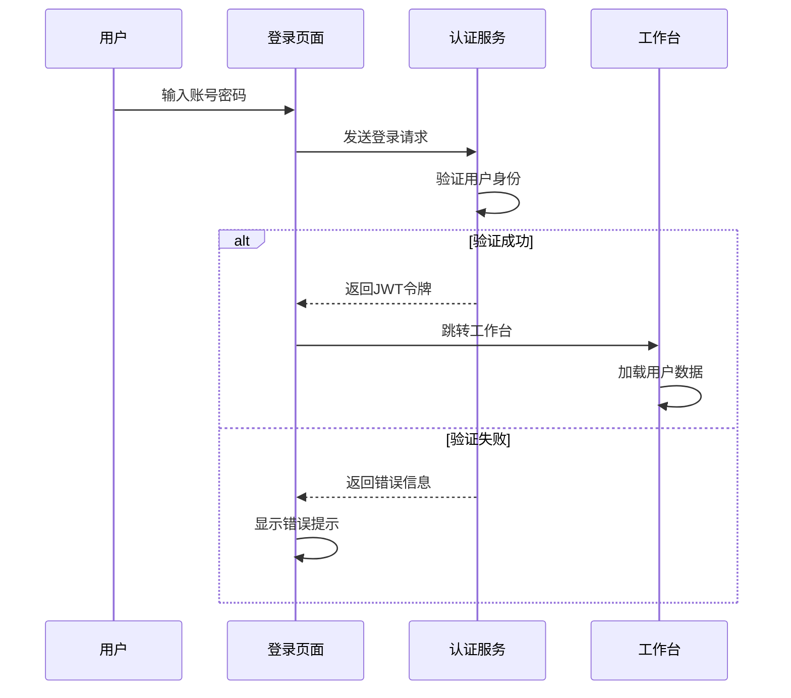
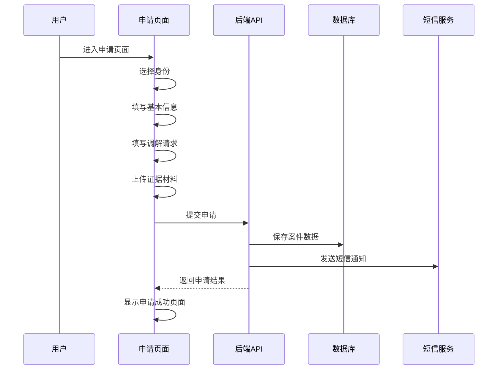
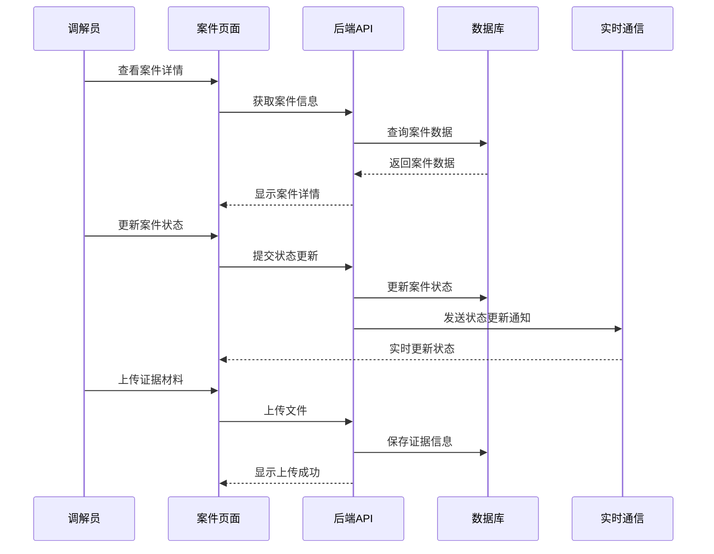
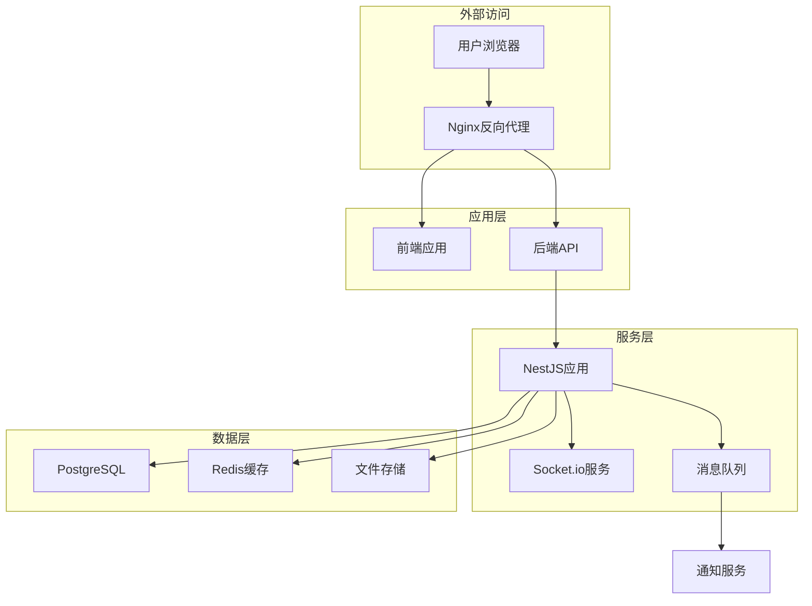

# 劳动仲裁调解系统详细设计文档

## 1. 系统概述

### 1.1 系统简介

劳动仲裁调解系统是一个为街道劳动人事争议调解中心设计的数字化平台，旨在提供完整的案件管理、调解流程跟踪和信息管理功能。系统支持多种用户角色，包括调解员、管理员、个人用户和企业用户，提供从案件登记到结案的全流程管理。

### 1.2 系统目标

1. **提高工作效率**：通过数字化流程减少人工操作，提高案件处理效率
2. **规范调解流程**：标准化调解流程，确保案件处理的一致性和公正性
3. **增强透明度**：提供案件状态实时查询，增强调解过程的透明度
4. **提升服务质量**：通过信息化手段提升调解服务的质量和满意度
5. **数据驱动决策**：通过数据分析为管理决策提供支持

### 1.3 设计原则

1. **模块化设计**：系统采用模块化设计，便于维护和扩展
2. **用户体验优先**：注重用户体验，设计直观、易用的界面
3. **安全性**：采用多层次安全措施，保护系统和数据安全
4. **可靠性**：系统设计注重可靠性，确保稳定运行
5. **可扩展性**：系统架构支持未来功能扩展和业务增长

## 2. 功能设计

### 2.1 功能模块划分

| 模块 | 功能描述 | 角色 |
| :--- | :--- | :--- |
| 认证授权 | 用户登录、权限验证、角色管理 | 所有角色 |
| 工作台 | 个性化数据展示、待办事项、快捷操作 | 所有角色 |
| 到访登记 | 记录来访信息、生成编号、发送通知 | 调解员 |
| 案件查询 | 案件信息检索、结果展示、筛选功能 | 所有角色 |
| 申请调解 | 多步骤表单、数据验证、申请提交 | 个人/企业 |
| 案件管理 | 案件详情、状态管理、证据管理 | 调解员/管理员 |
| 站内广播 | 消息发布、通知推送、实时通信 | 调解员/管理员 |
| 数据分析 | 统计图表、数据可视化、报表生成 | 调解员/管理员 |
| 通知服务 | 短信发送、邮件通知、系统提醒 | 所有角色 |

### 2.2 详细功能设计

#### 2.2.1 认证授权模块

| 功能点 | 描述 | 实现方式 |
| :--- | :--- | :--- |
| 多角色登录 | 支持调解员、管理员、个人、企业四种角色登录 | JWT + 角色验证 |
| 密码管理 | 密码加密存储、密码重置、密码强度检查 | bcrypt + 密码策略 |
| 权限控制 | 基于角色的权限控制，不同角色访问不同功能 | RBAC模型 |
| 会话管理 | JWT令牌管理、会话过期处理 | Redis + JWT |

#### 2.2.2 工作台模块

| 功能点 | 描述 | 实现方式 |
| :--- | :--- | :--- |
| 数据统计 | 展示案件统计数据、待办事项数量 | ECharts + API数据 |
| 待办事项 | 展示用户待办案件、待处理任务 | 个性化数据筛选 |
| 快捷操作 | 提供常用功能的快捷入口 | 角色基于配置 |
| 通知中心 | 展示系统通知、案件更新提醒 | 实时通信 + 通知列表 |

#### 2.2.3 到访登记模块

| 功能点 | 描述 | 实现方式 |
| :--- | :--- | :--- |
| 到访记录 | 记录来访者基本信息、到访事由 | 表单提交 + 数据验证 |
| 编号生成 | 自动生成到访登记编号 | 规则生成 + 唯一性检查 |
| 短信通知 | 向来访者发送包含登记编号的短信 | 第三方短信API集成 |
| 记录查询 | 查询历史到访记录 | 条件查询 + 分页展示 |

#### 2.2.4 案件查询模块

| 功能点 | 描述 | 实现方式 |
| :--- | :--- | :--- |
| 条件查询 | 通过当事人姓名、案件编号等条件查询 | 多条件组合查询 |
| 结果展示 | 展示案件基本信息、状态、进度 | 表格展示 + 详情链接 |
| 筛选排序 | 支持按状态、日期等筛选排序 | 前端筛选 + 后端排序 |
| 详情查看 | 查看案件详细信息 | 权限验证 + 详情页面 |

#### 2.2.5 申请调解模块

| 功能点 | 描述 | 实现方式 |
| :--- | :--- | :--- |
| 多步骤表单 | 分步骤填写申请信息，减少用户负担 | 步骤导航 + 表单验证 |
| 身份选择 | 选择申请人或被申请人身份 | 角色切换 + 表单适配 |
| 信息填写 | 填写当事人信息、争议事实、请求事项 | 表单验证 + 数据格式化 |
| 证据上传 | 上传案件相关证据材料 | 文件上传 + 类型验证 |
| 申请提交 | 提交调解申请，生成案件编号 | 数据验证 + 事务处理 |

#### 2.2.6 案件管理模块

| 功能点 | 描述 | 实现方式 |
| :--- | :--- | :--- |
| 案件详情 | 展示案件完整信息、相关文档 | 详情页面 + 标签页 |
| 状态管理 | 更新案件状态、记录状态变更原因 | 状态机 + 变更记录 |
| 证据管理 | 上传、查看、管理案件证据 | 文件存储 + 权限控制 |
| 调解记录 | 记录调解过程、生成调解笔录 | 富文本编辑器 + 模板 |
| 案件进度 | 记录案件处理进度、重要节点 | 时间轴 + 进度记录 |
| 线上调解 | 发起线上调解会议、邀请当事人 | 集成视频会议API |

#### 2.2.7 站内广播模块

| 功能点 | 描述 | 实现方式 |
| :--- | :--- | :--- |
| 消息发布 | 发布通知、公告、重要信息 | 富文本编辑器 + 权限控制 |
| 广播类型 | 支持不同类型的广播（通知、交接、政策等） | 类型分类 + 样式区分 |
| 紧急程度 | 支持设置不同紧急程度 | 紧急程度标记 + 提醒方式 |
| 实时推送 | 广播消息实时推送到前端 | Socket.io + 消息队列 |
| 历史记录 | 查看历史广播消息 | 分页查询 + 搜索功能 |

#### 2.2.8 数据分析模块

| 功能点 | 描述 | 实现方式 |
| :--- | :--- | :--- |
| 案件统计 | 案件数量、类型、状态统计 | ECharts + 数据聚合 |
| 调解效率 | 调解时长、成功率统计 | 时间计算 + 比率分析 |
| 调解员绩效 | 调解员工作量、成功率统计 | 个人数据聚合 |
| 趋势分析 | 案件数量、类型变化趋势 | 时间序列分析 + 图表 |
| 报表导出 | 导出统计报表为Excel、PDF | 模板渲染 + 文件生成 |

#### 2.2.9 通知服务模块

| 功能点 | 描述 | 实现方式 |
| :--- | :--- | :--- |
| 短信通知 | 发送案件状态变更、会议提醒等短信 | 第三方短信API集成 |
| 邮件通知 | 发送重要文档、会议纪要等邮件 | SMTP + 模板 |
| 系统提醒 | 系统内消息提醒、待办事项通知 | 站内消息 + 红点提示 |
| 通知配置 | 配置通知模板、发送规则 | 模板管理 + 规则配置 |

## 3. 交互设计

### 3.1 页面流程图

#### 3.1.1 登录流程



#### 3.1.2 申请调解流程



#### 3.1.3 案件管理流程



### 3.2 页面设计

#### 3.2.1 登录页面

| 元素 | 功能 | 交互 |
| :--- | :--- | :--- |
| 登录标题 | 系统名称和标题 | 静态展示 |
| 角色选择 | 选择登录身份 | 下拉选择 |
| 用户名输入 | 输入用户名 | 文本输入 |
| 密码输入 | 输入密码 | 密码输入 |
| 登录按钮 | 提交登录请求 | 点击提交 |
| 忘记密码 | 密码重置功能 | 链接跳转 |
| 错误提示 | 显示登录错误 | 动态提示 |

#### 3.2.2 工作台页面

| 元素 | 功能 | 交互 |
| :--- | :--- | :--- |
| 统计卡片 | 展示案件统计数据 | 点击查看详情 |
| 待办列表 | 显示待处理案件 | 点击进入案件 |
| 快捷操作 | 常用功能入口 | 点击跳转 |
| 通知中心 | 显示系统通知 | 点击查看详情 |
| 刷新按钮 | 刷新页面数据 | 点击刷新 |
| 搜索框 | 搜索案件 | 输入搜索 |

#### 3.2.3 申请调解页面

| 元素 | 功能 | 交互 |
| :--- | :--- | :--- |
| 步骤导航 | 显示申请流程步骤 | 点击切换步骤 |
| 身份选择 | 选择申请人/被申请人 | 点击选择 |
| 表单输入 | 填写申请信息 | 文本输入 |
| 文件上传 | 上传证据材料 | 拖拽上传 |
| 下一步按钮 | 进入下一步 | 点击提交 |
| 上一步按钮 | 返回上一步 | 点击返回 |
| 提交按钮 | 提交申请 | 点击提交 |
| 表单验证 | 验证输入数据 | 实时验证 |

#### 3.2.4 案件管理页面

| 元素 | 功能 | 交互 |
| :--- | :--- | :--- |
| 案件信息 | 展示案件基本信息 | 静态展示 |
| 状态更新 | 更新案件状态 | 下拉选择 |
| 时间轴 | 显示案件进度 | 滚动查看 |
| 证据列表 | 展示证据材料 | 点击查看 |
| 上传按钮 | 上传新证据 | 点击上传 |
| 进度记录 | 添加案件进度 | 表单提交 |
| 线上调解 | 发起调解会议 | 点击发起 |
| 导出按钮 | 导出案件材料 | 点击导出 |

### 3.3 响应式设计

系统采用响应式设计，适配不同屏幕尺寸：

| 设备 | 屏幕尺寸 | 布局 |
| :--- | :--- | :--- |
| 桌面端 | ≥1200px | 多列布局，完整功能 |
| 平板端 | 768px-1199px | 双列布局，核心功能 |
| 移动端 | <768px | 单列布局，简化功能 |

## 4. 数据设计

### 4.1 数据模型

#### 4.1.1 用户模型

| 字段名 | 数据类型 | 约束 | 描述 |
| :--- | :--- | :--- | :--- |
| `id` | `UUID` | `PRIMARY KEY` | 用户ID |
| `username` | `VARCHAR(50)` | `UNIQUE NOT NULL` | 用户名 |
| `password_hash` | `VARCHAR(100)` | `NOT NULL` | 密码哈希 |
| `name` | `VARCHAR(50)` | `NOT NULL` | 真实姓名/单位名称 |
| `phone` | `VARCHAR(20)` | `NOT NULL` | 联系电话 |
| `email` | `VARCHAR(100)` | `UNIQUE` | 电子邮箱 |
| `address` | `VARCHAR(200)` | | 送达地址 |
| `role` | `VARCHAR(20)` | `NOT NULL` | 角色(mediator/admin/personal/company) |
| `id_card` | `VARCHAR(30)` | | 身份证号/统一社会信用代码 |
| `created_at` | `TIMESTAMP` | `NOT NULL DEFAULT NOW()` | 创建时间 |
| `updated_at` | `TIMESTAMP` | `NOT NULL DEFAULT NOW()` | 更新时间 |

#### 4.1.2 案件模型

| 字段名 | 数据类型 | 约束 | 描述 |
| :--- | :--- | :--- | :--- |
| `id` | `UUID` | `PRIMARY KEY` | 案件ID |
| `case_number` | `VARCHAR(30)` | `UNIQUE NOT NULL` | 案件编号 |
| `applicant_id` | `UUID` | `NOT NULL REFERENCES user(id)` | 申请人ID |
| `respondent_id` | `UUID` | `NOT NULL REFERENCES user(id)` | 被申请人ID |
| `dispute_type` | `VARCHAR(50)` | `NOT NULL` | 争议类型 |
| `case_amount` | `DECIMAL(12,2)` | | 涉案金额 |
| `request_items` | `TEXT` | `NOT NULL` | 请求事项 |
| `facts_reasons` | `TEXT` | `NOT NULL` | 事实与理由 |
| `status` | `VARCHAR(20)` | `NOT NULL` | 状态(pending/processing/completed/failed) |
| `mediator_id` | `UUID` | `REFERENCES user(id)` | 调解员ID |
| `created_at` | `TIMESTAMP` | `NOT NULL DEFAULT NOW()` | 创建时间 |
| `updated_at` | `TIMESTAMP` | `NOT NULL DEFAULT NOW()` | 更新时间 |
| `close_time` | `TIMESTAMP` | | 结案时间 |

#### 4.1.3 到访记录模型

| 字段名 | 数据类型 | 约束 | 描述 |
| :--- | :--- | :--- | :--- |
| `id` | `UUID` | `PRIMARY KEY` | 记录ID |
| `register_number` | `VARCHAR(30)` | `UNIQUE NOT NULL` | 登记编号 |
| `visitor_name` | `VARCHAR(50)` | `NOT NULL` | 来访者姓名 |
| `phone` | `VARCHAR(20)` | `NOT NULL` | 联系方式 |
| `visit_type` | `VARCHAR(20)` | `NOT NULL` | 来访类型(visit/phone) |
| `dispute_type` | `VARCHAR(50)` | | 争议类别 |
| `reason` | `TEXT` | `NOT NULL` | 事由描述 |
| `mediator_id` | `UUID` | `REFERENCES user(id)` | 接待调解员ID |
| `created_at` | `TIMESTAMP` | `NOT NULL DEFAULT NOW()` | 登记时间 |

#### 4.1.4 广播模型

| 字段名 | 数据类型 | 约束 | 描述 |
| :--- | :--- | :--- | :--- |
| `id` | `UUID` | `PRIMARY KEY` | 广播ID |
| `title` | `VARCHAR(100)` | `NOT NULL` | 广播标题 |
| `content` | `TEXT` | `NOT NULL` | 广播内容 |
| `type` | `VARCHAR(20)` | `NOT NULL` | 广播类型(handover/special/notice/policy) |
| `urgency` | `VARCHAR(20)` | `NOT NULL` | 紧急程度(normal/important/emergency) |
| `creator_id` | `UUID` | `NOT NULL REFERENCES user(id)` | 创建人ID |
| `created_at` | `TIMESTAMP` | `NOT NULL DEFAULT NOW()` | 创建时间 |

#### 4.1.5 案件进度模型

| 字段名 | 数据类型 | 约束 | 描述 |
| :--- | :--- | :--- | :--- |
| `id` | `UUID` | `PRIMARY KEY` | 进度ID |
| `case_id` | `UUID` | `NOT NULL REFERENCES case(id)` | 案件ID |
| `content` | `TEXT` | `NOT NULL` | 进度内容 |
| `type` | `VARCHAR(20)` | `NOT NULL` | 进度类型(register/accept/mediate/close) |
| `creator_id` | `UUID` | `NOT NULL REFERENCES user(id)` | 创建人ID |
| `created_at` | `TIMESTAMP` | `NOT NULL DEFAULT NOW()` | 创建时间 |

#### 4.1.6 证据模型

| 字段名 | 数据类型 | 约束 | 描述 |
| :--- | :--- | :--- | :--- |
| `id` | `UUID` | `PRIMARY KEY` | 证据ID |
| `case_id` | `UUID` | `NOT NULL REFERENCES case(id)` | 案件ID |
| `name` | `VARCHAR(100)` | `NOT NULL` | 证据名称 |
| `type` | `VARCHAR(20)` | `NOT NULL` | 证据类型(pdf/image/word/other) |
| `path` | `VARCHAR(200)` | `NOT NULL` | 存储路径 |
| `size` | `BIGINT` | `NOT NULL` | 文件大小(字节) |
| `uploader_id` | `UUID` | `NOT NULL REFERENCES user(id)` | 上传人ID |
| `upload_time` | `TIMESTAMP` | `NOT NULL DEFAULT NOW()` | 上传时间 |

#### 4.1.7 通知模型

| 字段名 | 数据类型 | 约束 | 描述 |
| :--- | :--- | :--- | :--- |
| `id` | `UUID` | `PRIMARY KEY` | 通知ID |
| `user_id` | `UUID` | `NOT NULL REFERENCES user(id)` | 接收用户ID |
| `type` | `VARCHAR(20)` | `NOT NULL` | 通知类型(sms/email/system) |
| `content` | `TEXT` | `NOT NULL` | 通知内容 |
| `status` | `VARCHAR(20)` | `NOT NULL` | 状态(sent/read/unread) |
| `created_at` | `TIMESTAMP` | `NOT NULL DEFAULT NOW()` | 创建时间 |
| `read_at` | `TIMESTAMP` | | 阅读时间 |

### 4.2 数据库设计

#### 4.2.1 表结构

**`users`表**
```sql
CREATE TABLE users (
    id UUID PRIMARY KEY DEFAULT gen_random_uuid(),
    username VARCHAR(50) UNIQUE NOT NULL,
    password_hash VARCHAR(100) NOT NULL,
    name VARCHAR(50) NOT NULL,
    phone VARCHAR(20) NOT NULL,
    email VARCHAR(100) UNIQUE,
    address VARCHAR(200),
    role VARCHAR(20) NOT NULL,
    id_card VARCHAR(30),
    created_at TIMESTAMP NOT NULL DEFAULT NOW(),
    updated_at TIMESTAMP NOT NULL DEFAULT NOW()
);

CREATE INDEX idx_users_role ON users(role);
CREATE INDEX idx_users_phone ON users(phone);
```

**`cases`表**
```sql
CREATE TABLE cases (
    id UUID PRIMARY KEY DEFAULT gen_random_uuid(),
    case_number VARCHAR(30) UNIQUE NOT NULL,
    applicant_id UUID NOT NULL REFERENCES users(id),
    respondent_id UUID NOT NULL REFERENCES users(id),
    dispute_type VARCHAR(50) NOT NULL,
    case_amount DECIMAL(12,2),
    request_items TEXT NOT NULL,
    facts_reasons TEXT NOT NULL,
    status VARCHAR(20) NOT NULL,
    mediator_id UUID REFERENCES users(id),
    created_at TIMESTAMP NOT NULL DEFAULT NOW(),
    updated_at TIMESTAMP NOT NULL DEFAULT NOW(),
    close_time TIMESTAMP
);

CREATE INDEX idx_cases_status ON cases(status);
CREATE INDEX idx_cases_mediator_id ON cases(mediator_id);
CREATE INDEX idx_cases_applicant_id ON cases(applicant_id);
CREATE INDEX idx_cases_respondent_id ON cases(respondent_id);
```

**`visitor_records`表**
```sql
CREATE TABLE visitor_records (
    id UUID PRIMARY KEY DEFAULT gen_random_uuid(),
    register_number VARCHAR(30) UNIQUE NOT NULL,
    visitor_name VARCHAR(50) NOT NULL,
    phone VARCHAR(20) NOT NULL,
    visit_type VARCHAR(20) NOT NULL,
    dispute_type VARCHAR(50),
    reason TEXT NOT NULL,
    mediator_id UUID REFERENCES users(id),
    created_at TIMESTAMP NOT NULL DEFAULT NOW()
);

CREATE INDEX idx_visitor_records_created_at ON visitor_records(created_at);
CREATE INDEX idx_visitor_records_mediator_id ON visitor_records(mediator_id);
```

**`broadcasts`表**
```sql
CREATE TABLE broadcasts (
    id UUID PRIMARY KEY DEFAULT gen_random_uuid(),
    title VARCHAR(100) NOT NULL,
    content TEXT NOT NULL,
    type VARCHAR(20) NOT NULL,
    urgency VARCHAR(20) NOT NULL,
    creator_id UUID NOT NULL REFERENCES users(id),
    created_at TIMESTAMP NOT NULL DEFAULT NOW()
);

CREATE INDEX idx_broadcasts_created_at ON broadcasts(created_at);
CREATE INDEX idx_broadcasts_type ON broadcasts(type);
```

**`case_progresses`表**
```sql
CREATE TABLE case_progresses (
    id UUID PRIMARY KEY DEFAULT gen_random_uuid(),
    case_id UUID NOT NULL REFERENCES cases(id),
    content TEXT NOT NULL,
    type VARCHAR(20) NOT NULL,
    creator_id UUID NOT NULL REFERENCES users(id),
    created_at TIMESTAMP NOT NULL DEFAULT NOW()
);

CREATE INDEX idx_case_progresses_case_id ON case_progresses(case_id);
CREATE INDEX idx_case_progresses_created_at ON case_progresses(created_at);
```

**`evidences`表**
```sql
CREATE TABLE evidences (
    id UUID PRIMARY KEY DEFAULT gen_random_uuid(),
    case_id UUID NOT NULL REFERENCES cases(id),
    name VARCHAR(100) NOT NULL,
    type VARCHAR(20) NOT NULL,
    path VARCHAR(200) NOT NULL,
    size BIGINT NOT NULL,
    uploader_id UUID NOT NULL REFERENCES users(id),
    upload_time TIMESTAMP NOT NULL DEFAULT NOW()
);

CREATE INDEX idx_evidences_case_id ON evidences(case_id);
CREATE INDEX idx_evidences_uploader_id ON evidences(uploader_id);
```

**`notifications`表**
```sql
CREATE TABLE notifications (
    id UUID PRIMARY KEY DEFAULT gen_random_uuid(),
    user_id UUID NOT NULL REFERENCES users(id),
    type VARCHAR(20) NOT NULL,
    content TEXT NOT NULL,
    status VARCHAR(20) NOT NULL,
    created_at TIMESTAMP NOT NULL DEFAULT NOW(),
    read_at TIMESTAMP
);

CREATE INDEX idx_notifications_user_id ON notifications(user_id);
CREATE INDEX idx_notifications_status ON notifications(status);
```

#### 4.2.2 数据迁移

使用Prisma的迁移工具进行数据库迁移，确保数据库结构与应用程序模型保持同步。迁移文件存储在`prisma/migrations`目录中，每次模型变更都会生成相应的迁移文件。

## 5. API设计

### 5.1 API接口规范

#### 5.1.1 接口命名规范

- **URL格式**：`/api/{version}/{module}/{resource}`
- **HTTP方法**：使用RESTful风格的HTTP方法
- **版本控制**：通过URL路径进行版本控制
- **响应格式**：统一使用JSON格式

#### 5.1.2 响应格式

```json
{
  "success": true,
  "data": {},
  "message": "操作成功",
  "code": 200
}
```

#### 5.1.3 错误处理

| 状态码 | 描述 | 示例 |
| :--- | :--- | :--- |
| 400 | 请求参数错误 | `{"success": false, "message": "参数错误", "code": 400}` |
| 401 | 未授权 | `{"success": false, "message": "未授权", "code": 401}` |
| 403 | 禁止访问 | `{"success": false, "message": "禁止访问", "code": 403}` |
| 404 | 资源不存在 | `{"success": false, "message": "资源不存在", "code": 404}` |
| 500 | 服务器错误 | `{"success": false, "message": "服务器错误", "code": 500}` |

### 5.2 核心API接口

#### 5.2.1 认证授权接口

| 接口 | 方法 | 功能 | 请求体 | 响应体 |
| :--- | :--- | :--- | :--- | :--- |
| `/api/v1/auth/login` | POST | 用户登录 | `{"username": "string", "password": "string", "role": "string"}` | `{"token": "string", "userInfo": {...}}` |
| `/api/v1/auth/refresh` | POST | 刷新令牌 | `{"token": "string"}` | `{"token": "string"}` |
| `/api/v1/auth/logout` | POST | 用户登出 | N/A | `{"success": true}` |
| `/api/v1/auth/me` | GET | 获取当前用户信息 | N/A | `{"userInfo": {...}}` |

#### 5.2.2 工作台接口

| 接口 | 方法 | 功能 | 请求体 | 响应体 |
| :--- | :--- | :--- | :--- | :--- |
| `/api/v1/dashboard` | GET | 获取工作台数据 | N/A | `{"stats": {...}, "pendingCases": [...], "notifications": [...]}` |
| `/api/v1/dashboard/stats` | GET | 获取统计数据 | N/A | `{"totalCases": 100, "pendingCases": 20, ...}` |
| `/api/v1/dashboard/pending` | GET | 获取待办事项 | N/A | `{"cases": [...]}` |

#### 5.2.3 到访登记接口

| 接口 | 方法 | 功能 | 请求体 | 响应体 |
| :--- | :--- | :--- | :--- | :--- |
| `/api/v1/visitor` | POST | 新增到访记录 | `{"visitorName": "string", "phone": "string", "visitType": "string", "disputeType": "string", "reason": "string"}` | `{"registerNumber": "string", "success": true}` |
| `/api/v1/visitor` | GET | 获取到访记录列表 | N/A | `{"records": [...]}` |
| `/api/v1/visitor/{id}` | GET | 获取到访记录详情 | N/A | `{"record": {...}}` |
| `/api/v1/visitor/today` | GET | 获取今日到访记录 | N/A | `{"records": [...]}` |

#### 5.2.4 案件查询接口

| 接口 | 方法 | 功能 | 请求体 | 响应体 |
| :--- | :--- | :--- | :--- | :--- |
| `/api/v1/case/query` | GET | 查询案件 | `{"name": "string", "status": "string"}` | `{"cases": [...]}` |
| `/api/v1/case/{id}` | GET | 获取案件详情 | N/A | `{"case": {...}, "progress": [...], "evidence": [...]}` |
| `/api/v1/case` | GET | 获取案件列表 | N/A | `{"cases": [...]}` |

#### 5.2.5 申请调解接口

| 接口 | 方法 | 功能 | 请求体 | 响应体 |
| :--- | :--- | :--- | :--- | :--- |
| `/api/v1/application` | POST | 提交调解申请 | `{"applicantInfo": {...}, "respondentInfo": {...}, "disputeType": "string", "caseAmount": 10000, "requestItems": "string", "factsReasons": "string"}` | `{"caseNumber": "string", "success": true}` |
| `/api/v1/application/draft` | POST | 保存申请草稿 | `{"applicantInfo": {...}, "respondentInfo": {...}, "disputeType": "string"}` | `{"draftId": "string", "success": true}` |
| `/api/v1/application/draft/{id}` | GET | 获取申请草稿 | N/A | `{"draft": {...}}` |

#### 5.2.6 案件管理接口

| 接口 | 方法 | 功能 | 请求体 | 响应体 |
| :--- | :--- | :--- | :--- | :--- |
| `/api/v1/case/{id}/status` | PUT | 更新案件状态 | `{"status": "string", "reason": "string"}` | `{"case": {...}, "success": true}` |
| `/api/v1/case/{id}/progress` | POST | 添加案件进度 | `{"content": "string", "type": "string"}` | `{"progress": {...}, "success": true}` |
| `/api/v1/case/{id}/mediator` | PUT | 分配调解员 | `{"mediatorId": "string"}` | `{"case": {...}, "success": true}` |
| `/api/v1/case/{id}/close` | PUT | 结案 | `{"status": "string", "reason": "string"}` | `{"case": {...}, "success": true}` |

#### 5.2.7 证据管理接口

| 接口 | 方法 | 功能 | 请求体 | 响应体 |
| :--- | :--- | :--- | :--- | :--- |
| `/api/v1/evidence` | POST | 上传证据 | `FormData` | `{"evidence": {...}, "success": true}` |
| `/api/v1/evidence/{id}` | GET | 获取证据详情 | N/A | `{"evidence": {...}}` |
| `/api/v1/evidence/{id}` | DELETE | 删除证据 | N/A | `{"success": true}` |
| `/api/v1/evidence/case/{caseId}` | GET | 获取案件证据 | N/A | `{"evidences": [...]}` |

#### 5.2.8 站内广播接口

| 接口 | 方法 | 功能 | 请求体 | 响应体 |
| :--- | :--- | :--- | :--- | :--- |
| `/api/v1/broadcast` | POST | 发布广播 | `{"title": "string", "content": "string", "type": "string", "urgency": "string"}` | `{"broadcast": {...}, "success": true}` |
| `/api/v1/broadcast` | GET | 获取广播列表 | N/A | `{"broadcasts": [...]}` |
| `/api/v1/broadcast/{id}` | GET | 获取广播详情 | N/A | `{"broadcast": {...}}` |
| `/api/v1/broadcast/latest` | GET | 获取最新广播 | N/A | `{"broadcasts": [...]}` |

#### 5.2.9 数据分析接口

| 接口 | 方法 | 功能 | 请求体 | 响应体 |
| :--- | :--- | :--- | :--- | :--- |
| `/api/v1/analysis/stats` | GET | 获取统计数据 | `{"startDate": "string", "endDate": "string"}` | `{"stats": {...}}` |
| `/api/v1/analysis/case-trend` | GET | 获取案件趋势 | `{"period": "string"}` | `{"trend": [...]}` |
| `/api/v1/analysis/mediator` | GET | 获取调解员分析 | N/A | `{"mediators": [...]}` |
| `/api/v1/analysis/dispute-type` | GET | 获取争议类型分析 | N/A | `{"types": [...]}` |
| `/api/v1/analysis/export` | GET | 导出分析报表 | `{"format": "string", "startDate": "string", "endDate": "string"}` | 文件下载 |

#### 5.2.10 通知服务接口

| 接口 | 方法 | 功能 | 请求体 | 响应体 |
| :--- | :--- | :--- | :--- | :--- |
| `/api/v1/notification` | POST | 发送通知 | `{"userId": "string", "type": "string", "content": "string"}` | `{"success": true}` |
| `/api/v1/notification` | GET | 获取通知列表 | N/A | `{"notifications": [...]}` |
| `/api/v1/notification/{id}/read` | PUT | 标记通知已读 | N/A | `{"success": true}` |
| `/api/v1/notification/unread` | GET | 获取未读通知 | N/A | `{"notifications": [...]}` |

## 6. 技术实现

### 6.1 前端实现

#### 6.1.1 技术栈

- **React 18**：使用函数式组件和Hooks
- **TypeScript**：提供类型安全
- **Ant Design**：UI组件库
- **Zustand**：轻量级状态管理
- **React Router**：路由管理
- **Axios**：HTTP客户端
- **ECharts**：数据可视化
- **Vite**：构建工具

#### 6.1.2 核心组件

| 组件 | 描述 | 文件位置 |
| :--- | :--- | :--- |
| `Layout` | 系统布局组件 | `src/components/layout/Layout.tsx` |
| `LoginForm` | 登录表单组件 | `src/components/business/LoginForm.tsx` |
| `DashboardStats` | 工作台统计组件 | `src/components/business/DashboardStats.tsx` |
| `VisitorForm` | 到访登记表单 | `src/components/business/VisitorForm.tsx` |
| `CaseQuery` | 案件查询组件 | `src/components/business/CaseQuery.tsx` |
| `CaseApplyForm` | 申请调解表单 | `src/components/business/CaseApplyForm.tsx` |
| `CaseDetail` | 案件详情组件 | `src/components/business/CaseDetail.tsx` |
| `BroadcastList` | 广播列表组件 | `src/components/business/BroadcastList.tsx` |
| `AnalysisChart` | 数据分析图表 | `src/components/business/AnalysisChart.tsx` |
| `FileUpload` | 文件上传组件 | `src/components/common/FileUpload.tsx` |

#### 6.1.3 状态管理

使用Zustand进行状态管理，按功能模块划分store：

| Store | 描述 | 文件位置 |
| :--- | :--- | :--- |
| `authStore` | 认证状态管理 | `src/store/authStore.ts` |
| `caseStore` | 案件状态管理 | `src/store/caseStore.ts` |
| `visitorStore` | 到访登记状态管理 | `src/store/visitorStore.ts` |
| `broadcastStore` | 广播状态管理 | `src/store/broadcastStore.ts` |
| `notificationStore` | 通知状态管理 | `src/store/notificationStore.ts` |

#### 6.1.4 API服务

使用Axios封装API服务，按功能模块划分：

| 服务 | 描述 | 文件位置 |
| :--- | :--- | :--- |
| `authService` | 认证相关API | `src/services/authService.ts` |
| `caseService` | 案件相关API | `src/services/caseService.ts` |
| `visitorService` | 到访登记API | `src/services/visitorService.ts` |
| `broadcastService` | 广播相关API | `src/services/broadcastService.ts` |
| `analysisService` | 数据分析API | `src/services/analysisService.ts` |
| `notificationService` | 通知相关API | `src/services/notificationService.ts` |

### 6.2 后端实现

#### 6.2.1 技术栈

- **Node.js 18**：JavaScript运行时
- **NestJS 10**：企业级Node.js框架
- **TypeScript**：提供类型安全
- **Prisma 5**：现代化ORM
- **PostgreSQL 15**：关系型数据库
- **Redis 7**：缓存系统
- **Socket.io 4**：实时通信
- **JWT**：认证令牌

#### 6.2.2 核心模块

| 模块 | 描述 | 文件位置 |
| :--- | :--- | :--- |
| `AuthModule` | 认证授权模块 | `src/auth/` |
| `CaseModule` | 案件管理模块 | `src/case/` |
| `VisitorModule` | 到访登记模块 | `src/visitor/` |
| `ApplicationModule` | 调解申请模块 | `src/application/` |
| `BroadcastModule` | 站内广播模块 | `src/broadcast/` |
| `AnalysisModule` | 数据分析模块 | `src/analysis/` |
| `EvidenceModule` | 证据管理模块 | `src/evidence/` |
| `NotificationModule` | 通知服务模块 | `src/notification/` |
| `UserModule` | 用户管理模块 | `src/user/` |

#### 6.2.3 中间件

| 中间件 | 描述 | 文件位置 |
| :--- | :--- | :--- |
| `AuthGuard` | 认证守卫 | `src/shared/guards/auth.guard.ts` |
| `RoleGuard` | 角色守卫 | `src/shared/guards/role.guard.ts` |
| `LoggerMiddleware` | 日志中间件 | `src/shared/middleware/logger.middleware.ts` |
| `ErrorFilter` | 错误过滤器 | `src/shared/filters/error.filter.ts` |
| `ValidationPipe` | 验证管道 | `src/shared/pipes/validation.pipe.ts` |

#### 6.2.4 服务

| 服务 | 描述 | 文件位置 |
| :--- | :--- | :--- |
| `AuthService` | 认证服务 | `src/auth/auth.service.ts` |
| `CaseService` | 案件服务 | `src/case/case.service.ts` |
| `VisitorService` | 到访登记服务 | `src/visitor/visitor.service.ts` |
| `BroadcastService` | 广播服务 | `src/broadcast/broadcast.service.ts` |
| `AnalysisService` | 分析服务 | `src/analysis/analysis.service.ts` |
| `EvidenceService` | 证据服务 | `src/evidence/evidence.service.ts` |
| `NotificationService` | 通知服务 | `src/notification/notification.service.ts` |
| `SocketService` | 实时通信服务 | `src/shared/services/socket.service.ts` |

## 7. 安全设计

### 7.1 安全威胁分析

| 威胁 | 描述 | 影响 | 应对措施 |
| :--- | :--- | :--- | :--- |
| 身份伪造 | 未经授权的用户访问系统 | 数据泄露，操作滥用 | 强密码策略，多因素认证 |
| 数据窃取 | 攻击者窃取敏感数据 | 隐私泄露，法律风险 | 数据加密，HTTPS传输 |
| 权限提升 | 用户获取超出权限的访问 | 数据篡改，系统滥用 | 基于角色的权限控制 |
| 注入攻击 | 攻击者通过输入注入恶意代码 | 系统被控制，数据被破坏 | 输入验证，参数化查询 |
| 拒绝服务 | 攻击者使系统无法正常运行 | 服务中断，业务影响 | 流量限制，监控告警 |
| 会话劫持 | 攻击者获取用户会话 | 身份冒用，数据泄露 | 会话超时，token加密 |

### 7.2 安全措施

#### 7.2.1 认证安全

- **密码安全**：使用bcrypt进行密码加密存储
- **JWT令牌**：使用RS256算法生成JWT令牌
- **令牌过期**：设置合理的令牌过期时间
- **刷新机制**：实现令牌刷新机制
- **多因素认证**：支持短信验证码等多因素认证

#### 7.2.2 授权安全

- **基于角色的访问控制**：实现RBAC模型
- **权限粒度**：细粒度的权限控制
- **权限审计**：记录权限变更和访问日志
- **最小权限原则**：用户只拥有必要的权限

#### 7.2.3 数据安全

- **数据加密**：敏感数据加密存储
- **传输加密**：使用HTTPS加密传输
- **输入验证**：严格的输入验证
- **输出编码**：防止XSS攻击
- **参数化查询**：防止SQL注入

#### 7.2.4 系统安全

- **安全中间件**：使用Helmet等安全中间件
- **CORS配置**：合理配置CORS策略
- **CSRF防护**：实现CSRF令牌
- **依赖安全**：定期更新依赖包
- **安全扫描**：定期进行安全扫描

#### 7.2.5 运维安全

- **日志记录**：详细的系统日志
- **监控告警**：实时监控和告警
- **备份恢复**：定期数据备份
- **访问控制**：服务器访问控制
- **安全审计**：定期安全审计

## 8. 部署与运维

### 8.1 部署架构



### 8.2 部署方案

#### 8.2.1 Docker容器化

使用Docker Compose进行容器化部署，包含以下服务：

- **nginx**：反向代理
- **frontend**：前端应用
- **backend**：后端API
- **postgres**：数据库
- **redis**：缓存
- **minio**：文件存储（可选）

#### 8.2.2 环境配置

| 环境 | 配置 | 文件 |
| :--- | :--- | :--- |
| 开发环境 | 本地开发配置 | `.env.development` |
| 测试环境 | 测试服务器配置 | `.env.test` |
| 生产环境 | 生产服务器配置 | `.env.production` |

#### 8.2.3 部署流程

1. **构建镜像**：使用Dockerfile构建应用镜像
2. **配置服务**：编写docker-compose.yml配置文件
3. **启动服务**：使用docker-compose up启动服务
4. **健康检查**：验证服务是否正常运行
5. **日志监控**：配置日志收集和监控

### 8.3 运维管理

#### 8.3.1 监控系统

使用Prometheus和Grafana进行系统监控，监控以下指标：

- **系统指标**：CPU、内存、磁盘使用情况
- **应用指标**：请求量、响应时间、错误率
- **数据库指标**：查询性能、连接数
- **业务指标**：案件数量、调解成功率

#### 8.3.2 日志管理

使用ELK Stack进行日志管理：

- **Elasticsearch**：存储日志
- **Logstash**：处理日志
- **Kibana**：可视化日志

#### 8.3.3 备份策略

| 备份项 | 频率 | 方式 | 保留期 |
| :--- | :--- | :--- | :--- |
| 数据库 | 每日全量，每小时增量 | pg_dump | 30天 |
| 文件存储 | 每日 | 增量备份 | 30天 |
| 配置文件 | 每次变更 | 版本控制 | 永久 |
| 日志文件 | 每日 | 归档 | 90天 |

#### 8.3.4 灾备方案

- **本地灾备**：同城异地备份
- **远程灾备**：跨地域备份
- **恢复演练**：定期进行恢复演练
- **业务连续性**：制定业务连续性计划

## 9. 测试策略

### 9.1 测试类型

| 测试类型 | 描述 | 工具 |
| :--- | :--- | :--- |
| 单元测试 | 测试单个函数或组件 | Jest, Mocha |
| 集成测试 | 测试模块间的交互 | Supertest, React Testing Library |
| 端到端测试 | 测试完整的用户流程 | Cypress, Puppeteer |
| 性能测试 | 测试系统性能和响应时间 | Artillery, JMeter |
| 安全测试 | 测试系统安全漏洞 | OWASP ZAP |

### 9.2 测试覆盖率

| 模块 | 目标覆盖率 |
| :--- | :--- |
| 核心功能 | ≥80% |
| 辅助功能 | ≥60% |
| 安全相关 | ≥90% |

### 9.3 测试环境

| 环境 | 配置 | 用途 |
| :--- | :--- | :--- |
| 开发环境 | 本地开发 | 开发过程中的测试 |
| 测试环境 | 模拟生产 | 集成测试和回归测试 |
| 预生产环境 | 生产配置 | 预上线验证 |
| 生产环境 | 生产配置 | 监控和应急测试 |

## 10. 结论与建议

### 10.1 设计总结

本设计文档详细描述了劳动仲裁调解系统的功能、交互、数据和技术实现方案。系统采用现代化的技术栈和架构，具有以下特点：

1. **模块化设计**：系统采用模块化设计，便于维护和扩展
2. **用户体验优先**：注重用户体验，设计直观、易用的界面
3. **安全性**：采用多层次安全措施，保护系统和数据安全
4. **可靠性**：系统设计注重可靠性，确保稳定运行
5. **可扩展性**：系统架构支持未来功能扩展和业务增长

### 10.2 实施建议

1. **分阶段实施**：采用敏捷开发方法，分阶段实施系统功能
2. **优先核心功能**：优先开发核心业务功能，确保系统基本可用性
3. **用户培训**：在系统上线前进行用户培训，确保用户能够熟练使用
4. **持续优化**：系统上线后，根据用户反馈持续优化
5. **技术支持**：建立技术支持机制，及时解决用户问题

### 10.3 未来展望

1. **智能调解**：集成AI技术，提供智能调解建议
2. **移动应用**：开发移动应用，提供随时随地的访问能力
3. **区块链技术**：使用区块链技术确保调解过程的不可篡改性
4. **大数据分析**：利用大数据分析提升调解服务质量
5. **生态系统**：与其他司法系统集成，构建完整的司法生态

---

**文档作者**：技术团队
**文档日期**：2026-02-08
**版本**：1.0
